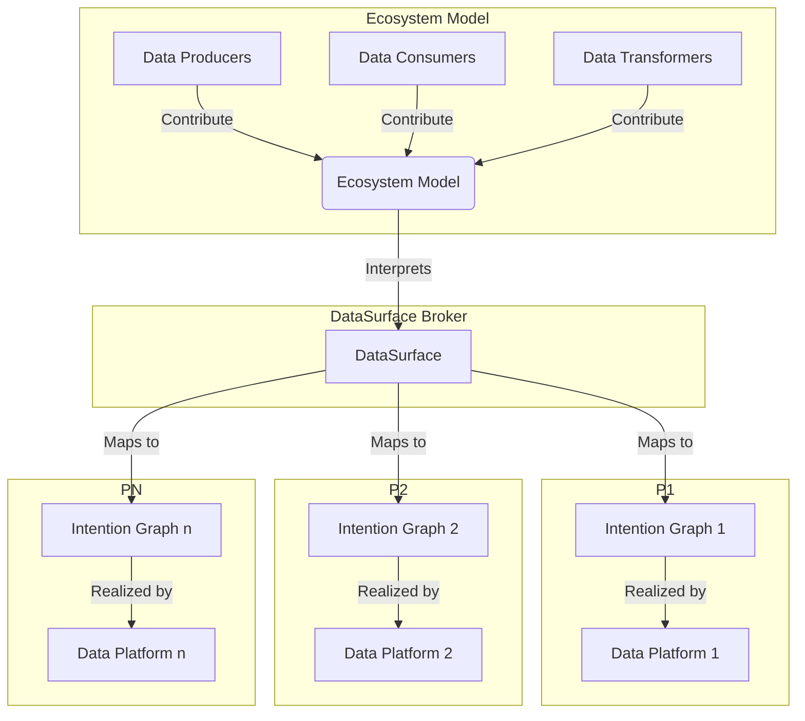

[](https://mariadb.com/bsl11/) [](CODE-OF-CONDUCT.md)

> :warning: **Work in progress**: This project is being implemented in phases. Phase 1 is complete as of March 2024. Phase 3 as of July 2025, implementing the [YellowDataPlatform](docs/yellow_dp/README.md) is 99% finished. This provides a working data platform offering live and milestones based data ingestion. Please see the [roadmap](ROADMAP.md) for details on when features should drop and the road map. Apologies for the docs, I need to refresh them urgently.

# DataSurface: A Data Ecosystem Broker

**DataSurface is to pipelines what S3 was to storage.**

## The Problem

Enterprise data pipelines are a nightmare. Teams build point-to-point connections creating **P × C pipelines** (producers × consumers), leading to:

- **Combinatorial explosion** of maintenance overhead
- **Vendor lock-in** to specific technologies  
- **Data teams drowning in infrastructure** instead of creating value
- **Compliance and governance chaos** across fragmented systems

Most producers are not data infrastructure experts, yet they're forced to build and maintain complex pipelines.

## The Solution

Imagine a world where enterprises can share and manage data effortlessly, without drowning in complex pipelines or outdated tech. DataSurface is a revolutionary data ecosystem broker that connects producers, consumers, and transformers with the best platforms automatically—slashing costs, boosting efficiency, and ensuring compliance. By turning data movement into a declarative, gitops-driven process, we free your teams to focus on creating value, not plumbing. With DataSurface, your data ecosystem evolves seamlessly, governed smartly, and scales effortlessly—ready for today and tomorrow.

## Why DataSurface?

- **Reduce pipeline complexity** from P × C to P + C + T (producers + consumers + transformers)
- **Eliminate vendor lock-in** - switch data platforms transparently
- **Focus on value, not plumbing** - teams build applications, not infrastructure  
- **GitOps for data** - declarative, version-controlled data ecosystem
- **Automatic upgrades** - pipelines evolve with technology, reducing technical debt
- **Smart governance** - compliance policies enforced automatically across all platforms

## Perfect For

- **Data Platform Teams** building enterprise data infrastructure
- **Application Developers** who need data without pipeline complexity
- **Data Engineers** tired of maintaining brittle point-to-point pipelines
- **CTOs** seeking to reduce data infrastructure costs and technical debt

## How It Works

### Redefining IaC as "Intention As Code"

DataSurface redefines IaC from "Infrastructure as Code" to IaC 2.0 or "Intention As Code". This is a better way for the actors within an enterprise to express their intentions for the data ecosystem. The ecosystem broker then interprets these intentions and creates the data pipelines needed to support the intentions in the model as well as makes sure these pipelines do not violate the governance policies of the enterprise.

The data ecosystem has the following actors:

* **Data Producers** - The owners of data. They have an application which produces data that is useful to the rest of the enterprise.
* **Data Consumers** - The owners of applications that consume data. They need data to do their job.
* **Data Transformers** - The owners of applications that transform data thats already available in the enterprise in to new data that is useful to the rest of the enterprise.
* **Data Platform owners** (new) - Development teams who create a Data platform product that can be used to satisfy the needs of data consumers.
* **Ecosystem Broker** (new) - This arbitrates between consumers intentions and the available data platform products to meet the data actors needs.



### The Ecosystem Broker Approach

DataSurface, the broker, then arbitrates between the desires of the consumers of the data ecosystem and the available DataPlatforms. DataSurface selects a DataPlatform for each consumer. DataSurface then generates the data flow graph for each Dataplatform in use. This graph includes all consumers assigned to that DataPlatform as well as the data pipelines from those consumers back through any data transformers all the way to Data Producers. [See the DataPlatform section for more information](docs/DataPlatform.md)

The DataPlatforms then make that graph a reality by creating the infrastructure to support that graph. There will be an initial set of DataPlatforms provided with DataSurface and others can be added over time as technology progresses. Consumers may be reassigned to a newer/improved DataPlatform over time and this should be transparent to the consumer. This means less technical debt as "pipelines" are automatically upgraded over time by DataSurface to use Dataplatforms using latest technology. The choice of the technology is not something producers or consumers should be concerned with, they just indicate what they need. Everything else, well it's just plumbing under the surface.

## What Developers Should Focus On

Enterprise developers should be performing only the following tasks:

* **Producing new data**
* **Consuming existing data to extract value**
* **Producing derivative value added data from existing data**

**Nobody should be writing data pipeline code.** The data ecosystem should be able to infer the data pipelines from the above metadata describing the data ecosystem. This metadata is a model of the data ecosystem. The model is stored in a CI/CD repository and is the official version of truth for the data ecosystem. The model is used to create and maintain data pipelines. The model is also used to provide governance and control over the data within the enterprise.

This model has contributions from ecosystem managers, data governors, data producers, data consumers, data transformers and data platforms. Together, a new element, the Ecosystem broker, interprets the intentions of these actors and creates the data pipelines needed to support the intentions in the model as well as makes sure these pipelines do not violate the governance policies of the enterprise.

This model is expressed using a Python DSL and is stored in a CI/CD repository such as GitHub which serves as the official version of truth for the model. Authorization for modifying different elements of the model is federated. Each region of the model can be assigned to be modifiable using only pull requests from a specific CI/CD repository/branch.

## Key Features

### Modern Data Types
DataSurface supports the multiple of floating point formats (low precision floating point types) widely using in machine learning and artificial intelligence research. It also supports the traditional data types such as strings, integers, dates, arrays, maps, structures and times. See the [Data Types](docs/DataTypes.md) document for more information.

### GitOps Integration
Datasurface uses CI/CD repositories in a novel way, at least to our knowledge. You can read more about the [approach here](docs/HowGitHubIsUsed.md).

The main repository uses github action handler to make sure the central model stays self consistent, backwards compatible and consistent with the governance policies of the enterprise.

## Getting Started

Please see the [Getting started document for more information](docs/GettingStarted.md).

For more information on using DataSurface with other CI/CD repositories besides GitHub please see [here](docs/HowToReplaceGithubAsTheRepository.md).

---

## Project Structure

``` text
|-- .github                     # Contains the GitHub Actions for the project
|-- docs                        # Contains documentation for the project
|-- Diary                       # Contains the diary of the project, this is a stream of consciousness type of writing about whats happening or the thinking at a given point in time
    |-- BillyN                  # Contains the diary of BillyN with a file per month.
|-- src
    |-- datasurface             # Contains the DataSurface Catalog Python code
        |-- cmd                 # Contains the command line utilities for container images   
        |-- codegen             # Contains code to generate python model code representing SQL table schemas
        |-- handler             # Contains the code to validate model changes and verify that pull requests are valid
        |-- md                  # Contains the model metadata code itself. This is the model of the data ecosystem
        |-- platforms           # Contains the DataSurface DataPlatform Python code
            |-- legacy          # Contains the legacy DataPlatform Python code
            |-- yellow_dp       # Contains the YellowDataPlatform Python code
    |-- tests                   # Contains the tests for the DataSurface Catalog Python code
```
