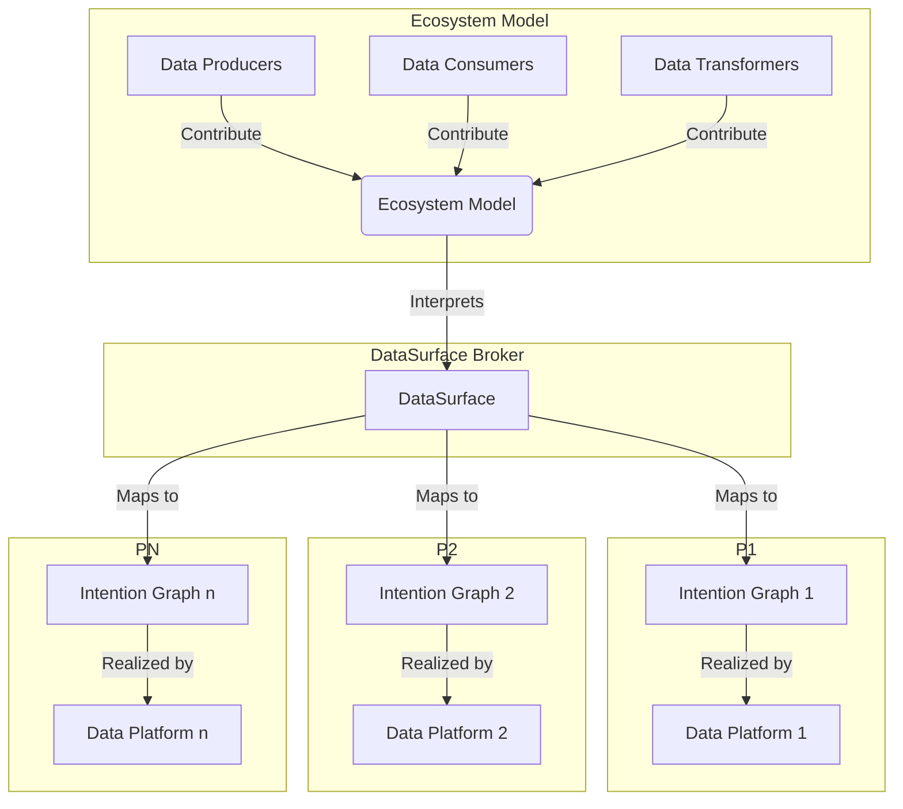

[](https://mariadb.com/bsl11/) [](CODE-OF-CONDUCT.md)

> :warning: **Work in progress**: This project is being implemented in phases. Phase 1 is complete as of March 2024. Work on an Kafka Connect/Confluent Cloud DataPlatform is underway. Please see the [roadmap](ROADMAP.md) for details on when features should drop and the road map.

# Project file layout

``` text
|-- .github                     # Contains the GitHub Actions for the project
|-- docs                        # Contains documentation for the project
|-- java                        # Contains the Java code for the DataSurface
    |-- dmsingestor             # Contains the DataSurface Ingestor Spark Job code
        |-- build.gradle        # Gradle build file for the DataSurface Ingestor Spark Job
        |-- src                 # Source code
|-- src
    |-- datasurface             # Contains the DataSurface Catalog Python code
        |-- api                 # Contains the DataSurface Catalog API GRPC Python code for serving models
            |-- Docker          # Contains the docker files to build the Docker Container for the GRPC server
        |-- codegen             # Contains code to generate python model code representing SQL table schemas
        |-- handler             # Contains the code to validate model changes and verify that pull requests are valid
        |-- md                  # Contains the model metadata code itself. This is the model of the data ecosystem
        |-- platforms           # Contains the DataSurface DataPlatform Python code
            |-- aws             # Contains the AWS Batch DataPlatform Python codeI have a 
            |-- azure           # Contains the Azure Batch DataPlatform Python code
    |-- tests                   # Contains the tests for the DataSurface Catalog Python code
```

# Data surface, a data ecosystem broker

DataSurface manages the movement of data to satisfy the requirements of data consumers from data producers. It does this by allowing data consumers to specify their requirements of how they want to consume data. Data Surface then chooses a data pipeline provider which can satisfy those requirements. DataSurface does this on a consumer by consumer basis and allows different providers to be choosen for a set of requirements over time as technology improves.

The goals of this project to make it much easier and lower cost for actors within an enterprise or between enterprises to share data. The project introduces a new concept, the ecosystem broker which arbitrates between a CI/CD based model which emcompasses the intentions of the data actors in an enterprise and the catalog of available data platform products to meet the data actors needs. The set of data pipelines the data platforms construct is hidden from the actors. The broker takes the intentions of the actors and constructs the data pipelines needed to meet the intentions of the actors. The broker also makes sure the data pipelines do not violate the governance policies of the enterprise.

## Redefining IaC as "Intention As Code"

DataSurface redefines IaC from "Infrastructure as Code" to IaC 2.0 or "Intention As Code". This is a better way for the actors within an enterprise to express their intentions for the data ecosystem. The ecosystem broker then interprets these intentions and creates the data pipelines needed to support the intentions in the model as well as makes sure these pipelines do not violate the governance policies of the enterprise.

The data ecosystem has the following actors:

* Data Producers. The owners of data. They have an application which produces data that is useful to the rest of the enterprise.
* Data Consumers. The owners of applications that consume data. They need data to do their job.
* Data Transformers. The owners of applications that transform data thats already available in the enterprise in to new data that is useful to the rest of the enterprise.
* Data Platform owners (new). Development teams who create a Data platform product that can be used to satisfy the needs of data consumers.
* Ecosystem Broker (new). This arbitrates between consumers intentions and the available data platform products to meet the data actors needs.



## Modern Data Types

DataSurface supports the multiple of floating point formats (low precision floating point types) widely using in machine learning and artificial intelligence research. It also supports the traditional data types such as strings, integers, dates, arrays, maps, structures and times. See the [Data Types](docs/DataTypes.md) document for more information.

## Traditional Data pipeline systems

Traditionally, enterprises build pipelines directly connecting producers to consumers. This can lead to as many as P * C pipelines where P is the number of producers and C is the number of consumers. This is a combinatorial explosion of pipelines. This is a maintenance nightmare and a huge cost to the enterprise. Most producers are not data infrastructure experts. The broker replaces these bespoke pipelines with an instance of a Dataplatform chosen to meet the needs of the consumer and this DataPlatform can be easily changed over time when newer/better DataPlatform implementations become available. The ecosystem broker reduces the number of pipelines to P + C + T where T is the number of data transformers. This is a much more manageable number of pipelines.

## A better way to do data pipelines, the ecosystem broker

This provides a new way to manage data in an enterprise. The goals are:

* introduce an ecosystem model which describes the intentions of producers, consumers, data transformers and data platforms in an enterprise. This model is stored in a CI/CD repository such as GitHub and is the official version of truth for the data ecosystem.
* to raise the abstration level for the actors using data in an enterprise. Actors can simply state their intentions and the ecosystem broker figures how best to achieve the collective goals of all actors using data in the enterprise. Using data means moving data from where it's produced to where its consumed. It's likely this will always be the case as it's unlikely a single database technology will ever handle ALL data use cases and regardless of technology, there are geographical limitations of a single store. Data moves.
* to evolve data movement to be a declarative process rather than a procedural process. It finally brings managing data to the "gitops" mindset. This is a game changer for managing data in an enterprise.
* to turn data pipelines in to a commodity product and simultaeneously introduce the ecosystem broker which continuously chooses the best products for each consumer use case in an ecosystem over time automatically
* better govern and control the data ecosystem of a firm as all data can be easily moved around a firm using the ecosystem approach using a declarative framework.

Enterprise developers should be performing only the following tasks:

* Producing new data
* Consuming existing data to extract value
* Producing derivative value added data from existing data

Nobody should be writing data pipeline code. The data ecosystem should be able to infer the data pipelines from the above metadata describing the data ecosystem. This metadata is a model of the data ecosystem. The model is stored in a CI/CD repository and is the official version of truth for the data ecosystem. The model is used to create and maintain data pipelines. The model is also used to provide governance and control over the data within the enterprise.

This model has contributions from ecosystem managers, data governors, data producers, data consumers, data transformers and data platforms. Together, a new element, the Ecosystem broker, interprets the intentions of these actors and creates the data pipelines needed to support the intentions in the model as well as makes sure these pipelines do not violate the governance policies of the enterprise.

This model is expressed using a Python DSL and is stored in a CI/CD repository such as GitHub which serves as the official version of truth for the model. Authorization for modifying different elements of the model is federated. Each region of the model can be assigned to be modifiable using only pull requests from a specific CI/CD repository/branch.

Datasurface uses CI/CD repositories in a novel way, at least to our knowledge. You can read more about the [approach here](docs/HowGitHubIsUsed.md).

The main repository uses github action handler to make sure the central model stays self consistent, backwards compatible and consistent with the governance policies of the enterprise.

DataSurface, the broker, then arbitrates between the desires of the consumers of the data ecosystem and the available DataPlatforms. DataSurface selects a DataPlatform for each consumer. DataSurface then generates the data flow graph for each Dataplatform in use. This graph includes all consumers assigned to that DataPlatform as well as the data pipelines from those consumers back through any data transformers all the way to Data Producers. [See the DataPlatform section for more information](docs/DataPlatform.md)

The DataPlatforms then make that graph a reality by creating the infrastructure to support that graph. There will be an initial set of DataPlatforms provided with DataSurface and others can be added over time as technology progresses. Consumers may be reassigned to a newer/improved DataPlatform over time and this should be transparent to the consumer. This means less technical debt as "pipelines" are automatically upgraded over time by DataSurface to use Dataplatforms using latest technology. The choice of the technology is not something producers or consumers should be concerned with, they just indicate what they need. Everything else, well it's just plumbing under the surface.

Please see the [Getting started document for more information](docs/GettingStarted.md).

For more information on using DataSurface with other CI/CD repositories besides GitHub please see [here](docs/HowToReplaceGithubAsTheRepository.md).
