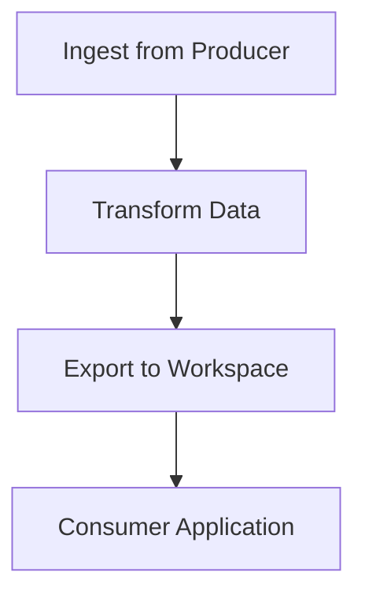

# DataSurface Architectural Decisions

## Overview

This document explains the revolutionary architectural decisions behind DataSurface's design and why it fundamentally differs from traditional data catalogs. DataSurface emerged from hard-learned lessons operating data platforms at massive enterprise scale (8 x 32-core HBase clusters, 2000-node Hadoop environments, millions of jobs daily).

**The Core Innovation:** DataSurface treats metadata as a **compiled artifact** rather than a **runtime service**, eliminating the scaling and compliance challenges that plague traditional data catalog architectures.

## The Traditional Data Catalog Crisis

### The Scaling Wall

Traditional data catalogs face insurmountable scaling challenges at enterprise levels:

**The Brutal Math:**
- **Millions of jobs per day** requiring metadata lookups
- **Every job needs:** datastore info, dataset schemas, location metadata  
- **Metadata calls exceed pipeline calls by 10x+**
- **Result:** Requires massive infrastructure just to serve metadata

**Real-World Pain Points:**
- 50 JVMs running on 50 x 32-core servers (1,600 cores) just for catalog APIs
- AWS Glue/Azure Data Factory collapse at 100+ nodes in job graphs
- Database connection pools, caching strategies, query optimization still insufficient
- Built for departmental workloads, not enterprise scale

```
Traditional Architecture Bottleneck:
┌─────────────────┐    thousands of     ┌──────────────────┐
│ Batch Job #1    │ ──────────────────▶│ Metadata DB      │ ← Bottleneck!
├─────────────────┤    concurrent       │ (PostgreSQL/     │
│ Batch Job #2    │ ──────────────────▶│  Oracle/HBase)   │ ← 50 JVMs needed
├─────────────────┤    metadata         │                  │
│ ...             │ ──────────────────▶│ Connection pool  │ ← Cache frantically
├─────────────────┤    lookups          │ Query optimizer  │ ← Still not enough
│ Batch Job #1M   │ ──────────────────▶│ Index management │
└─────────────────┘                     └──────────────────┘
```

### The Compliance Nightmare

Every traditional catalog vendor must reinvent enterprise compliance:

❌ **Custom audit logging** - "Who changed what when?"  
❌ **Approval workflows** - "Was this change authorized?"  
❌ **Validation tracking** - "Did this pass compliance checks?"  
❌ **Immutable audit trails** - "Can we prove no tampering?"  
❌ **Role-based access** - "Who can change what?"  
❌ **Enterprise auth integration** - "Does this work with our SSO?"

**Result:** Expensive, custom, often inadequate compliance solutions that auditors don't trust.

### The Technology Lock-In Problem

Traditional catalogs force choices that become obsolete:

- **Hadoop → Spark → Kubernetes** (data processing)
- **MapReduce → Dataflow → dbt** (orchestration)  
- **MySQL → NoSQL → NewSQL** (storage)
- **On-prem → Cloud → Multi-cloud** (infrastructure)

Every 3 years, enterprises face massive rewrite costs as technology stacks become unfashionable.

## DataSurface's Revolutionary Solutions

### 1. Git-as-Database: Eliminating the Scaling Bottleneck

**The Paradigm Shift:**
- **Traditional:** Metadata as a **service** (database calls)
- **DataSurface:** Metadata as a **compiled artifact** (RAM lookup)

```
DataSurface Architecture - No Bottlenecks:
┌─────────────────┐    zero latency    ┌──────────────────┐
│ Batch Job #1    │ ──────────────────▶│ Local RAM Copy   │ ← No network!
├─────────────────┤    metadata        │ of Full Model    │
│ Batch Job #2    │ ──────────────────▶│                  │ ← No DB queries!
├─────────────────┤    lookups         │ Git-distributed  │
│ ...             │ ──────────────────▶│ Metadata         │ ← No connections!
├─────────────────┤                    │                  │
│ Batch Job #1M   │ ──────────────────▶│ (on every node)  │ ← Scales linearly!
└─────────────────┘                     └──────────────────┘
```

**Scaling Advantages:**
- **No connection pooling** - every node has the full model
- **No caching strategies** - metadata already in RAM  
- **No query optimization** - simple object access
- **Linear scaling** - add nodes, each gets its own copy
- **Zero network latency** - local memory access only

**Git's Natural Benefits:**
- **Atomic commits** - entire model changes as one unit
- **Built-in versioning** - every change tracked with full diff history
- **Distributed by design** - no single point of failure
- **Conflict resolution** - git merge handles concurrent changes
- **Cheap branching** - dev/staging/prod environments for free

### 2. SOX Compliance: Enterprise-Grade Audit for Free

DataSurface leverages Git's 20+ years of enterprise security hardening:

**✅ Perfect Audit Trail**
```bash
# Who changed this critical schema?
git blame schemas/customer_data.py

# What exactly changed in this sensitive dataset?  
git show commit-hash -- datastores/pii_data.py

# When was this governance policy modified?
git log --follow policies/data_retention.py
```

**✅ Bulletproof Authorization**
```yaml
# .github/CODEOWNERS enforces SOX segregation of duties
/governance/eu_zone/     @eu-data-governance-team
/datastores/financial/   @finance-data-stewards @audit-team  
/policies/sox/          @compliance-officers
```

**✅ Mandatory Review Process**
- **Branch protection** = no direct commits to main
- **Required reviewers** = compliance officer must approve
- **Status checks** = validation must pass before merge
- **Signed commits** = cryptographic proof of author

**✅ Immutable Validation Record**
```yaml
# GitHub Actions creates automatic audit trail
✅ Schema validation passed
✅ Security policy check passed  
✅ Backwards compatibility verified
✅ SOX compliance validation passed
✅ Approved by: compliance-officer@company.com
✅ Merged by: data-engineer@company.com
```

**The Auditor Advantage:**
- **Industry standard** tooling auditors already understand
- **Cryptographic integrity** makes tampering impossible
- **20+ years** of enterprise security hardening
- **Zero vendor lock-in** for compliance infrastructure

### 3. Technology Abstraction: Future-Proofing Against Churn

**The DataPlatform Innovation:**

DataSurface recognizes that technology stacks change every 3 years but business requirements remain stable.

**Users Care About (Stable):**
- ✅ Data arrives within SLAs
- ✅ Costs decrease over time  
- ✅ No massive rewrites every few years

**Technology Stacks (Ephemeral):**
- 🔄 Whatever's fashionable this quarter
- 🔄 Whatever the new team prefers  
- 🔄 Whatever promises 10x performance

**Intention Graphs:**
DataSurface generates intention graphs describing **what** needs to happen, not **how**:



Each DataPlatform renders its intention graph into:
- Infrastructure as Code (Terraform/CloudFormation)
- Job scheduling (Airflow DAGs)
- Data pipeline implementations

**Multi-Platform Architecture:**
```
┌─────────────────┐    ┌─────────────────┐
│ User Workspace  │    │ User Workspace  │
│ "I want my ETL" │    │ "I want my ETL" │ 
└─────────────────┘    └─────────────────┘
         │                       │
         ▼                       ▼
┌─────────────────┐    ┌─────────────────┐
│ DataSurface     │    │ DataSurface     │
│ DSL/Abstraction │ ══▶│ DSL/Abstraction │
└─────────────────┘    └─────────────────┘
         │                       │
         ▼                       ▼
┌─────────────────┐    ┌─────────────────┐
│ Platform A      │    │ Platform B      │  
│ Spark+Postgres  │    │ BigQuery+dbt    │
└─────────────────┘    └─────────────────┘
    (this year)         (next year)
```

**Result:** Users see improved performance and lower costs without rewrite pain. It's like switching from SSD to NVMe storage - users just see it's faster.

## Implementation Architecture

### Python DSL Design

Despite scale considerations, Python provides crucial advantages:

**✅ DSL Ergonomics**
```python
Dataset("users", 
    DDLColumn("id", Integer(), PrimaryKeyStatus.PK),
    DDLColumn("name", String(255))
)
```

**✅ Rapid Iteration** - DSLs evolve quickly during design phases  
**✅ Ecosystem Integration** - Natural fit with data tools (Airflow, dbt, Jupyter)  
**✅ Strong Typing** - pylance/mypy provide compile-time safety

### Scale Targets

Current implementation handles:
- **10,000+ datastores**
- **100,000+ datasets** (architecture capable of 12+ million)
- **3,000+ workspaces**  
- **40-50k datasets per data container**

### GitHub-Based Governance

**Hierarchical Repository Structure:**
```
┌─────────────────┐
│ Ecosystem Repo  │ ← Central authority (main branch)
│ eco.py          │ ← def createEcosystem() -> Ecosystem
└─────────────────┘
         │ authorizes
         ▼
┌─────────────────┐
│ Governance Zone │ ← Regional/regulatory boundaries  
│ Repositories    │ ← US, EU, APAC governance
└─────────────────┘
         │ authorizes
         ▼
┌─────────────────┐
│ Team            │ ← Individual data teams
│ Repositories    │ ← Own datastores + workspaces
└─────────────────┘
```

**Change Validation Process:**
1. **Model Consistency** - All references valid, schemas compatible
2. **Backwards Compatibility** - No breaking changes to existing consumers  
3. **Authorization** - Changes only from authorized repositories
4. **Policy Compliance** - Governance zone policies enforced

### Separation of Concerns

**Metadata (Git + RAM):**
- Datastores, schemas, policies, workspaces
- Relatively static (changes a few times per day)
- High read volume, low write volume
- Served from RAM for ultra-fast lookups

**Pipeline State (Conventional Database):**
- Job executions, task status, lineage logs, metrics
- High-frequency updates (millions per day)  
- Needs ACID transactions
- Time-series data patterns

*Database choice is platform-dependent: PostgreSQL for simple platforms, HBase/BigQuery/CockroachDB for larger scales.*

### Infrastructure as Code Generation

```python
# DataPlatform receives intention graph
intention_graph = broker.get_intention_graph(platform_id)

# Renders to Terraform/CloudFormation
terraform_code = platform.render_infrastructure(intention_graph)

# Commits to platform-specific branch
git.commit_infrastructure_code(terraform_code)

# Terraform applies changes
terraform.apply(terraform_code)
```

## Competitive Advantages Summary

| Traditional Catalogs | DataSurface |
|---------------------|-------------|
| Database bottlenecks | Git-distributed metadata |
| Massive infrastructure for scale | Linear scaling with Git clones |
| Custom compliance systems | Industry-standard Git audit |
| Technology lock-in | Platform abstraction layer |
| Departmental scale | Enterprise scale (millions of jobs) |
| Vendor-specific audit trails | Cryptographically secure Git history |
| Connection pooling complexity | Zero-latency RAM access |
| Custom approval workflows | GitHub-native reviews |

## Conclusion

DataSurface represents a fundamental architectural breakthrough in data catalog design. By treating metadata as a compiled artifact rather than a runtime service, it eliminates the scaling bottlenecks that plague traditional catalogs.

The key insights:

1. **Git-as-Database** solves the metadata scaling crisis by distributing the entire model to compute nodes
2. **SOX Compliance** comes free through Git's enterprise-grade audit capabilities  
3. **Technology Abstraction** future-proofs against the inevitable churn of data platform technologies

The result is a system that scales to millions of daily jobs while providing enterprise-grade compliance through industry-standard tooling - something no traditional data catalog can achieve. 