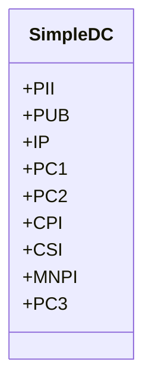
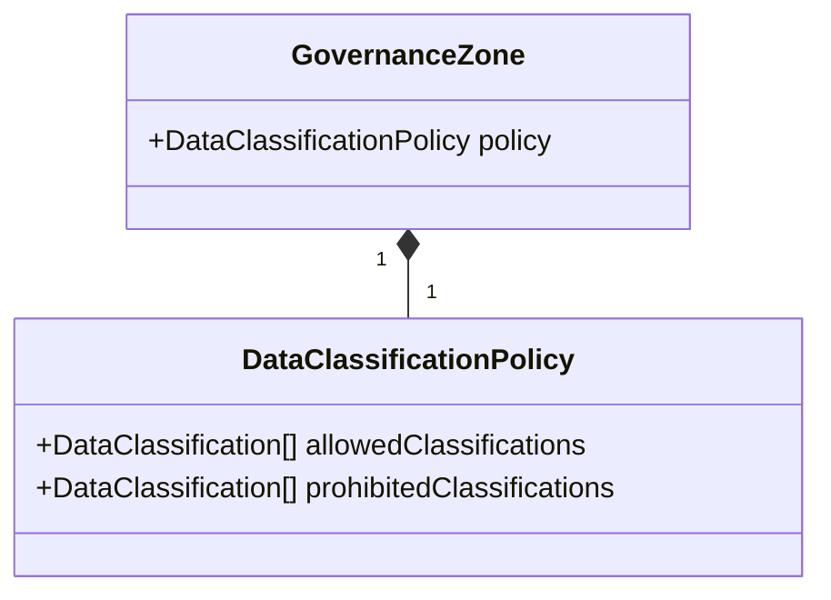
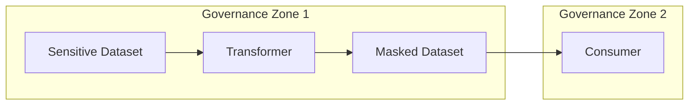

# Data Classifications

This document explains data classification and how the ecosystem can be governed using policies controlling what data can be stored where. Most firms will have at least one way of encoding what type of data is stored in a column or table/record. Thus, the data classification system of DataSurface is designed to handle this.

How can a firm have multiple data classification systems?

* A firm may have had siloed efforts previously and it's been decided to integrate them. Here, there may be N different classification schemes which can be migrated automatically or manually.
* A firm may have tens of thousands of datasets and been encoding their classifications diligently. If an org change occurs and it's decided a newer better data classification scheme is desired then the problem is how to migrate. This is unlikely to happen in one step. It may take weeks or months if the new classifications have to be reviewed and approved. In the meantime, you have 2 ways of classifying data, the old way and the new way. Indeed, org changes may occur before the migration completes...

When defining a new data classification scheme, thinking about automatic conversions from the old to the new is important. Thinking about how long a data classification scheme lasts in terms of months/years is important also. The firm should have a policy of how often such a migration will be tolerated as part of a contract with producers/consumers using the catalog.

## How DataSurface treats DataClassification

Given this reality, flexibility on how classification is done is key. It's possible to associate multiple DataClassifications with model elements as a result. This allows for a smooth transition from one classification scheme to another. It also allows for the coexistence of multiple classification schemes.

DataSurface allows data classifications to be specified at both the Dataset level as well as optionally at the attribute level. If it has been specified at the Dataset level then attribute level classifications are not allowed.

The DataClassification class is the basis for DataSurface classification. Model attributes and datasets can be associated with zero or more of these. There will be subclasses of DataClassification which will be used to define the specific classification schemes used by the enterprise.

## SimpleDC, the builtin DataClassification

DataSurface provides a default classification called SimpleDC. SimpleDC allows an enum and a string to be specified. The enum has the following values for commonly used classification levels:

There is also a string to indicate more context. For example, a PC3 SimpleDC might have a string of "SSN" to indicate that the PC3 data is Social Security Numbers. This provides more context than simply saying PC3.

## Associating a set of DataClassifications with an element

Why have a set of data classifications with a single element such as a Column or a Table? Columns may be a VarChar but can encode a json document or similar. A single classification may not be sufficient to describe whats happening in the Column JSON.

Tables are the same thing, when classifying a table, it's better to say this table has PII and MNPI information in it rather than having to choose either PII or MNPI.

## Marking attributes on schemas with data classification tags

Schemas are collections of records with identical schemas. The attributes/columns defined in the schema can be marked with a set of data classification values. This can be done on a column by column basis. It can also be overridden on the Dataset classification. If a Dataset has set of dataclassifications then all columns in the schema will also used that classifications even if the column is explicitly tagged. These unneeded tags on columns will be flagged as unnecessary during lint.

## Governance Zone Classification Policies

Governance Zones own teams which own Datastore/datasets. A Governance Zone can specify a DataClassificationPolicy which can control which types of data can be stored within the zone. This allows a Governance Zone to specify that (PC1,PC2,PC3) tagged attributes are not allowed. Governance Zones can also limit vendors whose products store data. For example, a Governance Zone may be defined to restrict the storage of PC1,PC2,PC3 data to internal servers only. Those teams/datastores defined within such a Zone are impacted by the Zone policy. A firm might setup two or more GovernanceZones to seperate data with different privacy levels.

A firm may have 2 governance zones. One which can store any classification of data. But, it may have restrictions on the vendors used to store the data. The other governance zone can be configured to allow internal and cloud vendors. It can however forbid data with classifications of PC1,PC2,PC3.

This means prevents data with PC1,PC2,PC3 classifications from being stored in the cloud. If a consumer needs these data sets then a masked version of those datasets must be produced by a datatransformer within the internal governance zone. The masked version can then be stored in the cloud.

