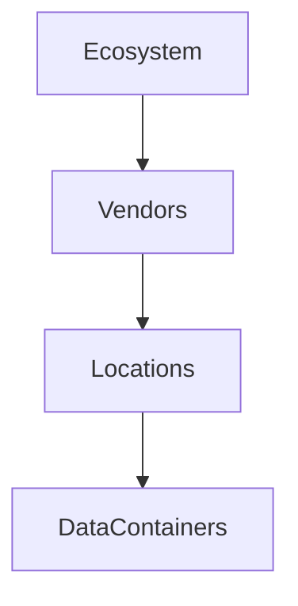

# DataContainers

DataSurface imagines data being persisted across the enterprise using DataContainers. DataContainers are persistent stores for data which allow client access through an API. Examples of common data containers would be:

* SQL Database
* Amazon S3 object storage
* Snowflake Columnar database
* FTP Server

These are all objects which can persist data. There are subclasses of DataContainer for these specific types of container. They have many features:

* Addressable (clients can connect somehow)
* Possible service side encryption
* Possible client side encryption
* Owned by an infrastructure vendor
* Physically located in one or more InfrastructureLocations owned by that vendor

DataSurface allows GovernanceZones to define policies that constrain the data containers which can store data or a certain class of data. For example, only store high private data on datacontainers which support client side encryption (prevents a cloud vendor from seeing the data)

## Data Producers have a DataContainer

Data producers specify in their CaptureMetaData a Datacontainer which holds the data thats available to the ecosystem. The producer provides metadata indicating how data can be ingested from the DataContainer persisting their data.

## Consumer Workspaces

Consumers want their data available using a DataContainer which is suited to their usecase. Consumers also specify how the data platforms can connect to the DataContainer being used for a Workspace. It's also possible for consumers to use a managed DataContainer. Here, the Dataplatform is responsible to assign the Workspace to one of many DataContainers available. The DataPlatform then assigns multiple Workspaces to a single Datacontainer and moves Workspaces around over a set of DataContainers to maintain high DataContainer utilization, lower costs and maintain consumer query performance.

Again, GovernanceZones may constrain the DataContainers that can be used to persist data under their governance.

## LogicalDataContainer

The DataContainer used for a Workspace is sometimes provided by the DataPlatform. The consumer does not specify an exact DataContainer instead they specify a LogicalDataContainer which at runtime is provided by the DataPlatform.

## DataContainers have a location and hosting vendor

DataContainers are located in one or more infrastructure locations. These locations are owned by a specific infrastructure vendor. The vendor is responsible for the physical infrastructure that the DataContainer is running on. The vendor is also responsible for the API that the DataContainer exposes to clients.

## Policies that can filter DataContainers available for persisting data

* StoragePolicy
* InfrastructureVendorPolicy
* InfrastructureLocationPolicy

## DataContainers and Schemas

DataContainers will have a supported schema. They support methods to take a producer schema and derive a compatible loss less schema that is compatible with the DataContainer.

This is important because the datacontainer used by the data producer will likely be different than the one used by this DataContainer. For example, a data producer may use an Oracle database where as a consumer Workspace may use an AWS Glue IceBerg columnar store. The producer schema needs to be mapped to a compatible schema for the consumer workspace data container.

## DataContainer and DataPlatform

DataContainers abstract the DataPlatform from the nuances of individual DataContainers. DataContainer is subclassed to provide a DataPlatform with an abstraction to interact with it. This means it provides schema mapping and naming assistance. The producer schema in the model needs to be converted to a schema that is compatible with the DataContainer. The DataContainer provides this service to the DataPlatform. The DataContainer also provides naming assistance for underlying table holding the raw data as well as the views that the consumer will use to query the data.
