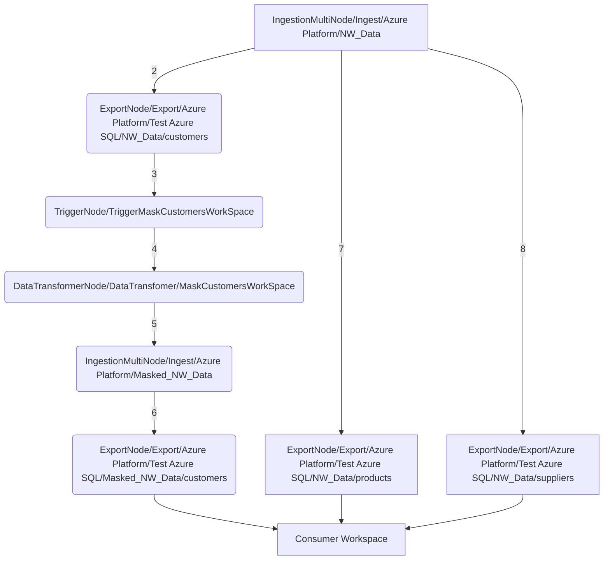

# Introduction to Dataplatforms

The main ecosystem model has the current data requirements as its metadata. It has metadata describing producers, consumers, data transformations and data platforms. Data platforms are used to handle clients data requests. The broker will select a specific platform to service a group of Workspaces in the model. The broker can even select multiple platforms to independently deliver data using different implementations/dataplatforms for a single consumer.Thus, a platform will be handling data store ingestions, exports to workspaces, triggers for and the execution of data transformer computations and all the job scheduling to make the data physically move.

There are a couple of ways to describe a DataPlatform. A DataPlatform supports a set of technologies for enabling consumers. It also has a philosophy of how to use those technologies to enable the consumer. For example, 2 DataPlatforms can use the same technological infrastructure but one streams and the other does batch.

An example philosophy could be a DataPlatform which ingests all its Data producers in to a Lakehouse type store. This acts like a persistent buffer between the producers and the consumers. This means the load on the producer data containers is always one no matter how many consumers there are. It also allows consumer data containers to be rehydrated from the buffer and catch up if those data containers were corrupted. The rehydration happens from the buffer, not the producer data containers. The buffer introduces latency but has benefits. There may be future DataPlatforms that instead of using a Lakehouse on DeltaLake or Iceberg, they may use some kind of streaming store which is more efficient and has less latency. This is the benefit of this architecture, when these newer DataPlatforms come along, the ecosystem can be updated to use them and the consumers will get the benefits of the new DataPlatform. When the new DataPlatform becomes available, EVERY consumer can get the benefits on day 1. Nothing needs to be reengineered.

## Command Query Responsibility Segregation (CQRS) and why it's critical

CQRS is real. It's rare for the technology which is best for ingesting data to be the best technology for providing that data to different consumers. It may be convenient/efficient to ingest data in to an iceberg/delta lake lake house. However, if consumers are doing very complex joins/aggregations over subsets of that data then it may be better to physically materialize the data in to a different technology to support the queries. Consumers may want to use OLTP/OLAP/Vector or document databases depending on their use case.Yes, there is more latency, it's 2 hops. But, this may be the only acceptable way to have happy consumers.

## Materialize an intention graph in to a physical system to fulfill the intentions of the graph

The work that a data platform has to do in terms of the data pipelines is provided as a graph of nodes from the Ecosystem. The DataPlatform must then take that graph and then generate a system which can fulfill the intentions expressed in that graph. The graph consists of nodes depicting the following actions:

* Ingest data from a Data producer
* Materialize or Export Data in an asset for use by a Workspace  
* Evaluate a trigger fora data transformer job
* Execute a data transformer

### Pipeline Graph Priority System

DataSurface implements a priority system where Workspaces can be assigned business criticality levels. These priorities automatically propagate through the pipeline graph to ensure that critical workloads receive appropriate resource allocation and scheduling priority from the underlying job orchestration systems.

The following represents a small intention graph. The Dataplatform has a single asset or database for all data pipeline steps to use, "Test Azure SQL". A consumer wants 3 datasets, 2 come from the NW_Data store, 1 comes from the Masked_NW_Data store. These are exported to the Workspace asset in steps 6,7 and 8. The 2 original datasets are ingested in step 1 (all 3 datasets: [products, suppliers and customers] are ingested together). Step 2 exports the original sensitive customer dataset to the datatransformer workspace "MaskCustomersWorkSpace". Then the datatransformer is executed in step 4 after being triggered in 3. The execution of the datatransformer causes the newly processed masked customer records to be ingested to the ecosystem in 5. The masked customer records are then exported to the consumer asset in 6.

This can be done using streaming or batch or forensic batch. The graph is just an intention graph.

A data platforms job is to take the latest set of changes and then render them in to "reality". For example, an Amazon AWS DataPlatform will take its graph and possibly convert it in to AWS Glue workflows.

When the ecosystem changes then the intention graph will also change. The Dataplatform must take the new version of its intention graph and render it on top of the existing system setup on the last iteration. The new render should minimize disruption and be as seamless as possible for the users. If the new graph simply represents that a consumer added a new Dataset to a Workspace then ideally, just create the table/views, entitle them, populate the table and then keep it up to date. If that dataset wasn't previously being ingested on this data platform then ingest it also. If the data platform is using Terraform on top of its physical infrastructure then terraform may be able to implement the changes in the new intention graph based on the old render.

Dataplatforms should be able to render large environments. Maybe 10k datastores, 100k datasets, hundreds of data containers for consumers to query and extract value from the data. Most cloud solutions are incapable of handling such large graphs. The Dataplatform will need a strategy to break up the total graph in to manageable chunks and linking them together in such a way that the infrastructure used by the DataPlatform can deal with it. This is an advantage of DataSurface over using vendor tools directly. This chunking isnt a problem users should need to deal with. Plus, the complexities of how these chunks running on different cloud vendors need to interact or be optimized similarly isn't something users should need to deal with. This is the job of the DataPlatform.

Dataplatforms supporting CQRS will likely find this easier to do. The ingestion of the data can be spread over a cluster of data pipeline instances. Consumers are hosted on a separate database tier which pulls/has pushed changes from the various data platforms for the datasets they need.

These environments also run thousands to millions of jobs a day to execute the pipeline. These jobs also have to be updated when a new metadata push arrives. It's recommended that platforms can shard themselves to make the catch up renders faster. Data can also be arriving slowly or rapidly.

Platform instances should be stored in the Ecosystem and provisioned when data platforms move to a new pipeline render.

A data platform is a mechanism to handle the follow chores:

* Manage a job scheduler to coordinate the follow
* Ingest data from a data store and persistently store in a data container Once, data is ingested then the data platform is also responsible to incrementally propagate data changes for a store to downstream consumer Workspaces.
* Track the retention requirements of Workspaces and make sure that the data can be reproduced for the required amount of time. This could be as much as 5 years so it's unlikely that a simple file format such as Apache Iceberg or Deltalake are sufficient. The data platform will likely need to store the data in a milestoned format to do this. File formats such as Iceberg or DeltaLake are not designed to handle long term retention required. They will typically try to compact/vacuum/conflate the deltas in the files to produce a new snapshot and once the snapshot is created then the deltas are deleted and thus the ingestion pull by pull changes are lost.
* Allow multiplatform fabrics to cooperate to connect data producers to data consumers. There may be a platform handling AWS whilst another platform handles AZURE and so on. The broker is responsible to define a protocol enabling data to flow between platforms.
* Data platforms will have their own operational state. This state might consist of its place ingestion a database using CDC. This state will likely by kept in an OLTP database.
* Dataplatforms are typically rendering using a specific branch from the github ecosystem. When the github ecosystem accepts new changes then the Dataplatform will need to advance to the next branch and then figure out what is the delta between the current rendering and the new proposed one. A Dataplatform will typically use generated IaC scripts to render the metadata described in the Ecosystem. The IaC should be completely generated from the Ecosystem metadata. Data platforms do not need to advanced instantly when the main Ecosystem is updated. Changes may be delayed till long weekends for example. Development environments with a dataplatform need to advance much faster as developers are waiting for their changes to be pushed rapidly.

## PlatformServicesProvider

There are multiple styles of DataPlatforms that will be available for a given runtime platform, whether it's AWS, Azure, private kubernetes, GCP and so on. These platforms will share a lot of code and common services. PlatformServicesProvider implementations represent where this common code and services are located and configured. For example, YellowDataPlatform runs on top of Kubernetes and Airflow. The Yellow PSP holds as much common code as possible allowing us to write different DataPlatforms which run on top of it without a lot of duplication. The Ecosystem model owns a list of PSPs and each PSP owns a list of DataPlatforms using it. DataPlatforms are globally uniquely named.

## Primary DataPlatform Ingestion (PIP)

To minimize load on production databases, DataSurface supports designating certain platforms as primary ingesters for specific data sources. Non-primary platforms can then obtain data from primary platforms rather than directly accessing source systems, creating an efficient data distribution hierarchy.

This is also used to pin ingestion of data from a remote environment to a specific set of machines which may be exposed in a firewall or positioned in a DMZ for this purpose, i.e. an onsite infrastructure and cloud infrastructure. You may want onsite systems to ingest data from a cloud environment through a concentrator to minimize egress costs for example.

## Example DataPlatform implementations

DataSurface is provided with a YellowDataPlatform. [You can read about it here](yellow_dp/README.md).

## Packaging DataPlatforms as Docker containers

The Ecosystem model allows DataPlatforms to be declared, parameterized/configured. The DataPlatform class and its subclasses are not intended to be the DataPlatform implementations.

The DataPlatform implementations are intended to be packaged and distributed as a separate package. The package will be a docker container image referenced by the DataPlatform in the model. DataSurface will use Kubernetes and the DataPlatforms container image to stand up a container for each instance of Dataplatform. The docker container will receive a copy of the model, any necessary secrets for credentials and its parameters so it can located its own configuration in the model. It's going to be easiest for the platform implementation to also be written in python given the model is described in python. This is a pro and con for the python based model.

## DataPlatforms and Terraform

However, a simpler approach may be to simply render the IaC code representation the DataPlatform implementation to a folder, check it in to a github branch and then configure Terraform cloud or similar to use that branch to render the infrastructure or keep it up to date when ever it changes. This may be a much simpler approach.

## DataPlatform Automation and Management

DataPlatforms are designed to be highly automated, self-managing systems that:

* Generate the intention graphs for all the DataPlatforms chosen for Consumers
* Render graphs into physical systems using Infrastructure as Code (IaC)
* Automatically manage job orchestration and scheduling
* Provide dynamic scaling based on ecosystem requirements
* Maintain synchronization with model changes through automated processes

The specific implementation approaches vary by platform - some may use Terraform workflows, others may employ dynamic job generation, and others may use hybrid approaches optimized for their target infrastructure.

## DataPlatforms need to use the model

If all aspects of a DataPlatform are written in Python then it's likely easiest just to check out the primary model from github and then load it. If the DataPlatform is written in languages other than Python then it will need a way to read model artifacts such as Datastores, ingestion metadata, schemas and so on. DataSurface provides a REST API to the model for this purpose. It can be easily started as a docker container and then used to query the model. The REST API is read only. It's documented [here](REST_API.md).

## DSG Platform Assignments

DSGs in the Ecosystem are assigned to specific DataPlatform instances using the dsg_platform_mapping.json file. This is typically managed by the ops team. Multiple DataPlatform instances can be assigned to a single DSG. This allows parallel deployments of different pipes to test out different dataplatforms or even versions of the same DataPlatform.

