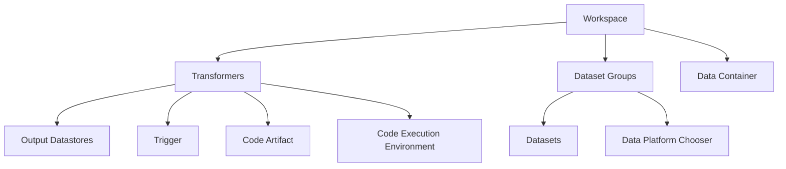

# Data Transformers

These are consumers which produce derivative data for further use in the Ecosystem. The consumer creates a Workspace with the data that is required for the data transform. The consumer defines an output Datastore for the derivative datasets produced from the Workspace. The consumer also defines a trigger which when the data transformer is executed. Even in a streaming pipeline, there will still be triggers. For example, a streaming pipeline may produce data over 60 second time windows and so on.

## Defining the inputs

A Data transformer is associated with a Workspace and a Workspace can have an optional single DataTransformer. Workspaces can only have one Datatransformer with the intent that the datasets in the Workspace are required for the data transformer to function. Data transformer developers should maintain the datasets in the Workspace to reflect their input requirements.

## Code artifacts

The developer codes the data transformer to query data in the Workspace and generate derivative data from that input data. This code can be written using any language/execution environment supported by the Data platforms. The developer specifies both the code artifact in terms of a versioned artifact in a repository and the execution environment which can take the artifact and execute it against the Workspace. An example artifact could be a pyspark job which needs a Spark execution env to run.

## Code Execution Environments

The CEE is a requirements document. It may specify that we need a Spark V3.5 level at least or a 4.0 Spark cluster. The runtime is managed elsewhere and this DataTransformer can only be executed if the environment supports the CEE.

The top level execution environment is defined/provisioned by a RenderEngine. DataPlatforms use those resources to provision
their data pipelines. A RenderEngine is a generic environment and can support many DataPlatforms so long as it contains the resources needed by the DataPlatform. See [MergeHandler](MergeHandler.md) for more details.

## Triggers

The data transformer can use any data in the Workspace. This data is exported and visible in some Asset. An asset could be a lakehouse, an object store with a delta file format and an associated data catalog. The trigger for executing this transformer can be simple or complex. One trigger may be to execute it every hour for example. Another might be to execute when a specific row is added to a dataset in the Workspace. It all depends. It doesn't matter whether the platform is batch or streaming, both will still require a trigger.

## Outputs

The data transformer specifies a single Datastore with any many datasets as needed. This data store is the ingested in to the Ecosystem for later use by its own consumers using their Workspaces. If noone uses the output data then the data transformer is not needed and not executed.

## How Data transformers and data platforms interact

When a consumer defines a Workspace, they also specify their non functional requirements. These requirements lead to the Ecosystem choosing a Dataplatform to host the data pipeline for that Workspace. A workspace may use multiple pipelines (one per Datasetgroup) and therefore multiple data platforms. An example would be a Workspace that has a DatasetGroup which requires a table with near time latency whilst another DatasetGroup has the same dataset with a forensic pipeline requirement (full milestoning). A consumer may calculate real time pricing with the near time dataset and end of day pricing with the forensic dataset.

The output datastore for a Datatransformer can thus be running twice (or more) on different data platforms possible for the same consumer. An Apache Beam pipeline implementation could run data in pulses through the transformer to a streaming DSG in a Workspace while another batch data platform also pulls data through the transformer for the batch based datasets in the Workspace.

**PROBLEM HERE:** This would mean there are N output Datastores with the same name but generated by N different DataPlatforms potentially. One could be live and the other batch milestoned for example, they are different and not interchangeable. This is a problem. The DataPlatform should be able to provide a unique name for the output Datastore. This is a problem for the DataPlatform to solve. This is true but the different dataplatforms will store the datastore in different locations so depending on which dataplatform is reading the data, they will see different data. For example. A Workspace is assigned to 2 different data platforms. They each use their own storage, there is no issue. The Datastore refers to the data stored in the dataplatform running that pipeline.

Right now, Yellow dataplatforms are either live or forensic. Maybe, it's better if they just do what the consumer wants? Share the dataplatform rather than define 2 different dataplatform instances, even if they are the same dataplatform.