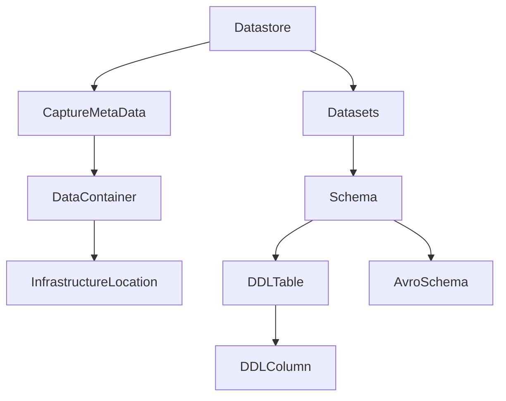

# Datastores and datasets

A data producer should define a Datastore representing the data that they wish to contribute to the ecosystem. The datastore is a named group of named datasets. Each dataset can be thought of an a collection of records with a common schema. The datastore also has an associated CaptureMetaData. This describes how a data platform can ingest data from this datastore. The data platform will use this information to create a data pipeline to ingest the data from the datastore and distribute it as needed to workspaces that the data platform is supplying data to.

The creation of a datastore and its associated metadata does not cause any data movement to occur. It is simply a declaration of the data that is available for use by the ecosystem. If a consumer references a dataset in a datastore from a DatasetGroup in a Workspace then the data platforms associated with the Datasetgrioups within that workspace will create data pipelines to move the data from the datastore to the workspace. The ecosystem will try to limit the number of data pipelines ingesting data from a datastore to one. This is to minimize the load on the producer from the ecosystem pipelines using their data.

A data producer with a number of datastores may choose to define their own Team with its own github repository to manage these datastores. A data producer who wishes to see the data should also create a Workspace referencing all the datasets/datastores. The producer can then use the Workspace together with their favorite data query tool to observe the data.



## Schema contract to Consumers

The schema the data producer exposes to the ecosystem through the datasets is the public facing schema or contract the producer agrees to honor to the consumers of the data. The producer may choose to create a Workspace with a data transformer connected to the original datastore which produces the public facing version of the data. The producer can then simply not allow any other Workspaces to reference the original datastore. Consumers can be sent to the data transformer output Datastore with the schemas the producer is willing to support. If the private datastore schema changes then these changes can be masked using the data transformer.

## Deprecation of data protocols

A producer can specify a deprecation status on a dataset or datastore. This is used to indicate that the data is either:

* NOT_DEPRECATED; Available for use
* DEPRECATED; Will shortly be removed or modified in a non backwards compatible fashion

A Workspace owner can specify that a DatasetSink can:

* Accept that the dataset can be deprecated by the producer
* Not allow datasets to be deprecated. The producers needs to talk with the Workspace consumer to see if the dataset can be deprecated.

The protocol is that a producer can first mark a dataset as deprecated and then later when noone is using it, remove or modify the dataset schema in a non backwards compatible fashion. First, the data producer will try to mark the dataset as deprecated. The pull request to the main repository can succeed in which case the change was successful. However, this is only possible if there are no Workspaces using the dataset OR the Workspaces that are using the dataset have acknoledged that the DatasetSink referencing the dataset can tolerate deprecated datasets. The protocol is, first the data producer tries to mark the dataset as deprecated. If this fails to merge then the data producer can look at the errors in the pull request and easily identify the Workspaces refusing to use deprecated datasets. The producer must then have a conversation out of band with the Workspace owners to see if the dataset can be deprecated. The Workspace owners may use an alternative dataset. The Workspace owners may also agree to the deprecation and then mark the datasetsink as allowing deprecation. This then allows the producer to deprecate the dataset. The Workspace owner then figures out a schedule for removing the dependency on the deprecated datasets. The Workspace owner changing the datasetsink is an acknowledgement that the conversation has taken place and that the Workspace owner is aware the dataset is deprecated and has a plan to remove the dependency on the dataset.

## Data Models

If a data producer insists on a specific data model/tooling being used against the datasets then they can control this by only granting permission to Workspaces who agree to this. The Data ecosystem is principally concerned with moving data from producers to consumers on appropriate data pipelines.

## Creating a Data producer

Lets assume there is already a team called OurTeam. We will add a new Datastore for the NorthWind database to it with one table or Dataset. We will specify that we can use SQL snapshot ingestion to ingest the data when a platform needs to.

```python
    # Find the EU Zone
    gzEU : GovernanceZone = eco.getZoneOrThrow("EU")
    # Define our team, we assume it's already been declared by the zone repo earlier.
    ourTeam : Team = gzEU.getTeamOrThrow("OurTeam")

    # Add the team documentation and a single Datastore to start.
    ourTeam.add(
        PlainTextDocumentation("This is our team responsible for various EU specific data and workspaces"),
        Datastore("EU_Customers",
            PlainTextDocumentation("EU Customer data"),
            # Capture Meta data to describe how a dataplatform will ingest this data source
            SQLSnapshotIngestion(
                PostgresDatabase(
                    "CustomerDB",  # Model name for database
                    hostPort=HostPortPair("customer-db.eu-central-1.rds.amazonaws.com", 5432),  # Host and port for database
                    locations={LocationKey("AWS:EU/eu-central-1")},  # Locations for database
                    databaseName="customer_db"  # Database name
                ),
                CronTrigger("Customer_Data Every 10 mins", "*/10 * * * *"),  # Cron trigger for ingestion
                IngestionConsistencyType.MULTI_DATASET,  # Ingestion consistency type
                Credential("postgres_customer_db", CredentialType.USER_PASSWORD)  # Credential for platform to read from database
            ),
            # A single dataset
            Dataset("customers",
                DataClassification.PC3, # Privacy high data
                PlainTextDocumentation("This data includes customer information from the Northwind database. It contains PII data."),
                DDLTable(
                    DDLColumn("customer_id", VarChar(5), NullableStatus.NOT_NULLABLE, PrimaryKeyStatus.PK),
                    DDLColumn("company_name", VarChar(40), NullableStatus.NOT_NULLABLE),
                    DDLColumn("contact_name", VarChar(30)),
                    DDLColumn("contact_title", VarChar(30)),
                    DDLColumn("address", VarChar(60)),
                    DDLColumn("city", VarChar(15)),
                    DDLColumn("region", VarChar(15)),
                    DDLColumn("postal_code", VarChar(10)),
                    DDLColumn("country", VarChar(15)),
                    DDLColumn("phone", VarChar(24)),
                    DDLColumn("fax", VarChar(24))
                )
            )))

```

This creates the team under the zone 'EU', and adds a single Datastore 'EU_Customers' to it. There is a snippet of documentation, SQL snapshot ingestion metadata that works with the Yellow platform, and a single dataset for the table customers.

**Required imports for this example:**
```python
from datasurface.md import LocationKey, Ecosystem, GovernanceZone, Team, PlainTextDocumentation, PostgresDatabase
from datasurface.md.governance import Datastore, Dataset, SQLSnapshotIngestion, HostPortPair, CronTrigger, IngestionConsistencyType
from datasurface.md.credential import Credential, CredentialType
from datasurface.md.schema import DDLTable, DDLColumn, NullableStatus, PrimaryKeyStatus
from datasurface.md.types import VarChar
from datasurface.md.policy import DataClassification
```

## Data classification

Data is contained within Datastores and Datasets. Data in some Schemas can be classified at the attribute or column level. The classification is used to determine the sensitivity of the data. For example, data that can be shared publicly is marked as DataClassification.PUB, data which is highly sensitive (social security numbers, national identity numbers) would be DataClassification.PC3. For more information on classification levels [see here](DataClassification.md). Please see [GovernanceZones](GovernanceZone.md) for how GovernanceZones can policy the use of data defined within a Zone based on its classification.

Different schemas will support different granularities of control with respect to Data classification. Some schemas will support per specifying it per attribute, others may just support a single classification for every attribute in the schema. While data classification can be defined at an attribute level, it can also be specified at the Dataset level. If its defined at the dataset level then it cannot be defined at the schema level or finer. This is detected in linting and will be reported to the user.

## Production Status

A datastore can be marked as PRODUCTION or NOT_PRODUCTION. This is used to indicate that the data is appropriate to use in production or not. Workspaces can similarly be marked and the ecosystem will ensure that only production data is used in production workspaces. The intention here is to prevent non production data being used in a production setting.

A PRODUCTION dataset must have DataClassifications available for all schema attributes. This can be either a schema level setting or a per attribute level setting.

## Schemas supported

DataSurface supports a tabular style schema and an Avro schema with a record as the primary attribute. The DataSurface schema and type system is discussed [here](DataTypes.md) for further information.

## Dataset partitioning

Producers specify a partitioning strategy for ingestion as part of their metadata. This works in terms of splitting the data for efficient ingestion. The problem is consumers, in my experience, sometimes want a different partitioning strategy. Re-partitioning a dataset is actually very expensive to do. For now, consumers cannot specify alternative partitioning strategies but this is something that could be added in the future.

## Datastores requiring approval of Consumers

It's possible for a Workspace/DSG to use a dataset without the Datastore owner knowing. If that consumer was used for critical reporting or regulatory reporting then if the data producer doesn't know about it then this can cause issues down the line with expectations.

Every datastore can specify an optional set of consumers who are allowed to use the datastore. These approvals if specified will be used to check that a consumer is allowed to use the datastore. The linting for teh consumer will fail if the consumer is not approved by the producer. The producer can then approve the consumer by adding the consumer (Workspace name/DSG name/dataset name) to the datastore. At which point the consumer linting will pass they refresh to a version of the model which has the approval.

This approval mechanism is optional. A Data producer whose approval set is None has disabled this feature. If they specify even an empty set then approval is required.
