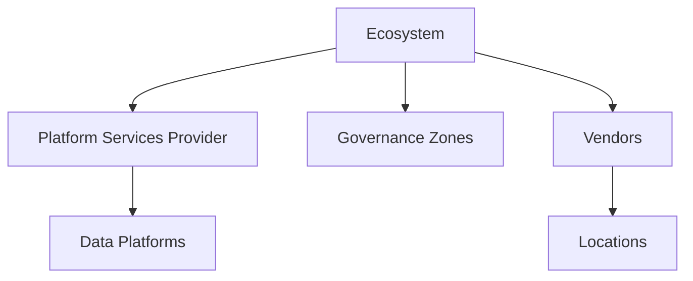
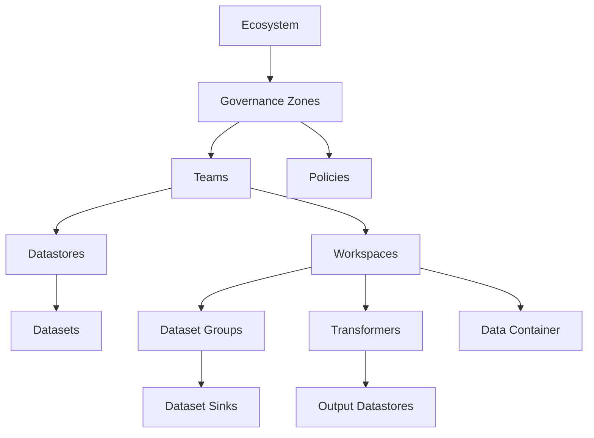

# What is a Data ecosystem?

Every enterprise has a data ecosystem. It comprises all the data within an enterprise, how it moves throughout the enterprise, the technologies used to process, store and move that data. Governance is about analyzing the ecosystem and making sure it meets policies designed to ensure best practises, keep the data safe, limit liability and enforce corporate or government policies/laws on storing sensitive data.

DataSurface tries to simplify this ecosystem providing a platform which can describe this ecosystem and then automatically provision as much of the infrastructure to implement it as possible. Ideally, it divorces the data producers, data consumers and data transformers from the infrastructure providing the services used to enable these actors to work together. These actors should not care about what kind of technology or technologies are being used to enable the shared data ecosystem that exists between these actors over time. This ecosystem should be provisioned in the same manner Amazon provides S3 storage. Actors consuming S3 storage do not care how Amazon provisions servers, or which brand of disks or network cards etc. They simply use object storage through S3. In the same way, we want to bring data ecosystems up to the same level of abstraction. How a data ecosystem is implemented, which cloud vendors are used, which databases, how data is moved around should be utterly of no concern to the actors using the data ecosystem so long as it works and obeys policies they may define constraining how an ecosystem can be used.



## Creating an empty Ecosystem

This can be done by setting up the main repository. The repository should have a requirements.txt which include the datasurface python package from pypi. The datasurface action handlers should be setup in a workflow. Once this is done then a starter eco.py file should be created in the root folder. Datasurface invokes the function createEcosystem() -> Ecosystem inside the eco.py module.

Here is an example starter:

```python
from datasurface.platforms.yellow import YellowPlatformServiceProvider
from datasurface.md.documentation import PlainTextDocumentation
from datasurface.md.repo import GitHubRepository
from datasurface.md.governance import (
    Ecosystem, GovernanceZoneDeclaration,
    InfrastructureLocation, InfrastructureVendor,
)

# Define a test Ecosystem
def createEcosystem() -> Ecosystem:
    e: Ecosystem = Ecosystem(
        "Test",
        GitHubRepository("owner/surfacerepo", "edit_main"),
        # Declare the Yellow PlatformServiceProvider
        YellowPlatformServiceProvider(...),
        GovernanceZoneDeclaration("USA", GitHubRepository("owner/repo", "main")),
        InfrastructureVendor(
            "Corporate",
            PlainTextDocumentation("Onsite"),
            InfrastructureLocation("NY"),  # New York
        ),
        liveRepo=GitHubRepository("owner/surfacerepo", "live_main"),
    )
    return e
```

### Repositories: owning vs live

An `Ecosystem` uses two repositories:

- owningRepo: the only repository from which pull requests will be accepted. Contributors must base changes on a clone of `liveRepo` maintained at `owningRepo`, then open a pull request back to `liveRepo` (policy checks and authorization run here).
- liveRepo: the authoritative, live model that platforms pull to run. No direct commits; changes become live only when merged from a PR originating in `owningRepo`.

Linting should ensure both are set and consistent; authorization is enforced against `owningRepo`, while runtime reads use `liveRepo`.

This defines a very simple Ecosystem. The live repository is at owner/surfacerepo with the branch live_main. The model at live_main is the model which will actually be used to provision the infrastructure. Edits to it should be via pull requests from the edit_main branch. There is a single PlatformServiceProvider available. There is a single GovernanceZone available called USA which uses the repository owner/repo and branch main.

Once this has been committed directly against the owner/surfacerepo#main then the USA zone can be defined from its repository.

## Ecosystems, GovernanceZones, PlatformServicesProviders and Data Platforms

An Ecosystem is a model containing all Data producers, Data consumers and Data transformers. Datasurface can connect the dot between these three actors to construct an intention graph representing the entirety of the work needed to be done to satisfy these three actors.



Data producers, consumers and data transformers are always owned by a single GovernanceZone. The GovernanceZone defines a set of policies for governing or policing the way any data or Workspaces owned by the governancezone can be used. This means a GovernanceZone can restrict vendors, classifications, locations, data platforms and so on. This means that the firms most sensitive data could be kept in an isolating governance zone which puts heavy restrictions on the data platforms and infrastructure that can be used to handle the data. For example, only the most trusted cloud vendor may be used to handle the data or possibly it may be only allowed within the firms private data centers on specific locked down assets. These rules apply to any use of the data, even when datasets are used by Workspaces in other governance zones. The rules of both zones are ANDed. This means some combinations may not be possible. For example, a dataset is in a private data center only zone. Another zone’s Workspace which is cloud only wants to use that dataset. This will not be allowed when the Workspace change to add the dataset is attempted to be merged in to the main ecosystem model. The GitHub workflows will disallow the inclusion of that dataset in that Workspace. Conversely, if the dataset was being moved from a less restrictive zone to a more restrictive zone then all the Workspaces using that dataset would need to be removed or modified to remove the dataset from the Workspace if a governance zone policy is violated before the dataset change can be made. This will usually require conversations with other teams to negotiate these changes.

### DSG→DataPlatform assignment mapping

At the ecosystem root, a `dsg_platform_mapping.json` file records DatasetGroup-to-DataPlatform assignments. Multiple DataPlatforms can be assigned to the same DSG to support migrations and parallel validation. Assignments typically flow through lifecycle states such as PROVISIONING, PROVISIONED, DECOMMISSIONING, and DECOMMISSIONED to enable safe cutovers and rollbacks.

### Model versioning for jobs

Platforms should execute against an immutable snapshot of the model (for example, a pre-cloned folder named `model-{timestamp}`). A job reads a single snapshot for its entire run to avoid mid-execution drift. New commits create new snapshots used by subsequent runs.

### Dynamic job generation

Some platforms generate runnable jobs dynamically from a persisted configuration rather than emitting static artifacts for every unit of work. This configuration-driven approach scales better for large numbers of ingestion streams and reduces file churn.

### Platform-aware validation

In addition to generic linting, the selected DataPlatform should validate a Workspace/DSG’s requirements (supported storage, triggers, features) before finalizing assignment.

The data producers provide metadata indicating how to ingest the data they produce. The Data consumers provide metadata indicating both what data they need, what kind of data container (or sometimes the specific asset) they need the data in and finally some requirements about how the data should get from the data producers to the Workspace.

Data platforms are how DataSurface turns intentions represented by the model in to reality. Data platforms move data in order to fulfill the intentions of the primary actors. Data movement and processing is thus a derivative action calculated purely from the primary actor intentions.

An Ecosystem can be analyzed, starting with all the consumers and worked backwards towards the data producers. The requirements of the consumers which are common can be used to select a single data platform for that group of consumers. This means that an Ecosystem will choose multiple Data platforms to share the workload asked of it by its data consumers. The mapping of consumer requirements to data platforms is dynamic and intended to be reasonably sticky. This means that once a data platform has been selected for a group of consumers it will be used for that group of consumers until the requirements of the consumers change OR a significantly better data platform becomes available.

DataSurface is capable of generating multiple pipeline graphs, one per DataPlatform selected. The union of these graphs will define the entirety of the data pipelines required to satisfy the data consumers of the Ecosystem. Each graph represents the workload for a single DataPlatform. Each Data Platform will take this graph and 'render' it in to a concrete data pipeline to achieve these goals.

As the Ecosystem is modified by its users, the graph will change. DataPlatforms will periodically re-render their graph and modify their operational graph to match the new graph. This pipeline upgrade to reflect the new graph can be very low cost or very expensive. The cost of the upgrade is really determined by the amount of state which must change for the upgrade to complete. If an upgrade requires a new Lakehouse to be configured and loaded with a PB of existing data then this won't happen in a few seconds. It may take days depending on the infrastructure available to the DataPlatform.

This doesn't mean delays of days between iterations of the Ecosystem DataPlatform renders. Data platform renders can still happen on a regular cycle. Our experience is that production changes usually don't have to be very timely. However, when developers are using the system then they expect their changes to be reflected in the data pipelines in a timely manner, minutes. Data platforms will need to satisfy both of these requirements.

Please see [Data platforms](DataPlatform.md) for more information.
