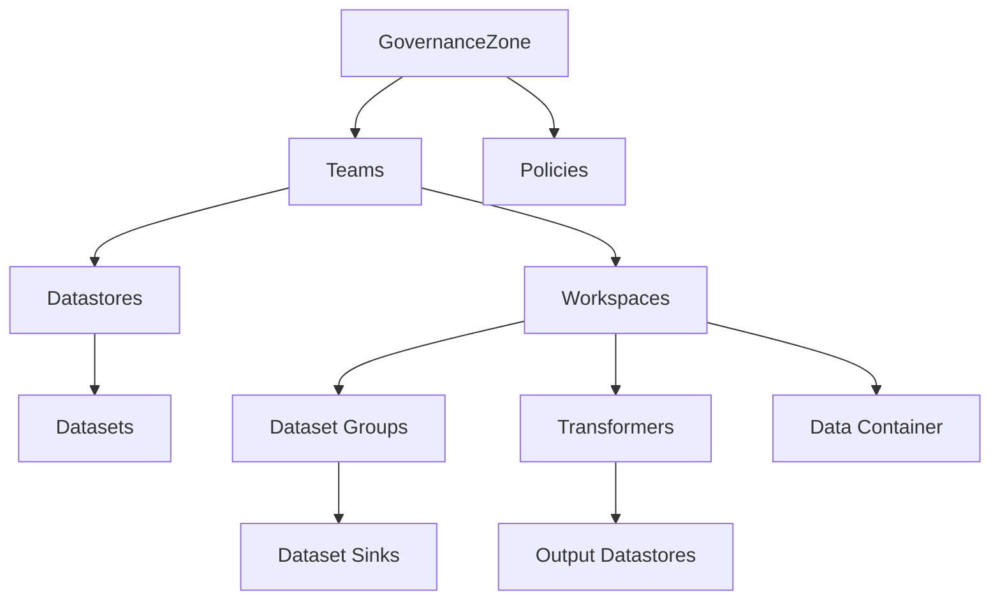

# Governance Zone

A governance zone is used to define a region of the data ecosystem. It constrains the data platforms, vendors and locations that can be used within a zone. For example, cloud vendors can be banned OR mandated for all data stores and consumers within a zone. The allowable data classification can also be restricted. A zone can be defined which can hold all data classifications/privacy levels but that bans all cloud vendors and mandates data is kept within the US for example. Another zone can be defined which allows cloud vendors but disallows PC1,PC2,PC3 data.



## Declaring a GovernanceZone

The ecosystem repository must declare the governance zone initially and indicate which repository will be used to make changes to the zone and its contents. Once this is committed then the governance zone can be used to specify the zone metadata. The zone repository should clone the main repository, make changes, commit them and then issue a pull request to make the changes in the main repository. The pull request will be vetted by the main repository and if it passes the vetting then the changes will be merged in to the main repository. At this point, the changes are live. If further changes are required to the zone then repeat this procedure.

```python
    # Define a governance zone
    eco.add(
        GovernanceZoneDeclaration("EU",
            GitHubRepository("owner/repo", "main"),
            PlainTextDocumentation("This is the EU governance zone. It is responsible for all data and workspaces in the EU."))
    )
```

This creates a governance zone called 'EU' and specifies the github repository and branch that will be used to make changes to the zone. The documentation is also added to the zone.

## Deleting a governance zone

All governance zone metadata should be removed from the zone repository and merged with the main repository. Once the governance zone is not longer defined at all then the zone declaration can be removed using the ecosystem repository.

If any other zones are using data stores/data sets from the zone to be deleted then they too must be deleted or modified to remove the references to the zone to be deleted. This is to ensure that the model remains consistent.

## Limiting the infrastructure vendors available within a zone

A governance zone can specify zero or more InfrastructureVendorPolicy objects. These can filter the list of vendors allowed to be used on this zones data. An individual policy can either disallow a set of vendors or allow a set of vendors.

```python
    gz.add(
        InfraStructureVendorPolicy("AWS Only", {e.getVendorOrThrow("AWS")}) # AWS Locations only
    )
```

This restricts all Data stores and Workspaces to only use a specific vendor. This constrains the Dataplatforms and assets used by the datastores and workspaces to only use the specified vendor.

## Limiting the infrastructure vendor locations available within a zone

A zone can specify zero of more InfrastructureLocationPolicy objects. These can filter the list of locations allowed to host assets where data policied by this zone can be stored. Data could be restricted to the EU or the USA.

```python
    gz.add(
        InfraStructureLocationPolicy("AWS US Only", e.getLocationOrThrow("AWS", ["USA"]).getEveryChildLocation())
    )
```

This policy forces only USA AWS locations to be used for storing data defined in this zone or with Workspaces defined in this zone.

## Limiting the data platforms available within a zone

A zone can also restrict the choices of dataplatforms available to the ecosystem for servicing the clients of its data. A dataplatform can ONLY use data that is allowed by the datasets governancezone.

```python
    gz.add(
        DataPlatformPolicy("AWS Platform only", {e.getDataPlatformOrThrow("AWS Platform")}) # AWS DataPlatform only
    )
```

This allows either a set of explicitly allowed or a set of displicitly disallowed set of DataPlatforms to be used with Workspaces OR Datastores defined in the zone. For example, a China based zone may only allow local cloud companies to be used to handle workspaces or data from Datastores defined within this zone.

## Limiting the data classifications available within a zone

A Governance Zone can be setup to only host data of specific classifications. This can be useful for setting up a restricted zone which holds sensitive data. That zone can restrict the data to enterprise private data centers for example. This prevents restricted data from being used in the cloud.

Another zone could be setup for data which has been cleared for use on the cloud and enterprise private data centers.

For example, a zone can add a DataClassificationPolicy indicating that no PC1,2 or 3 data can be used in Datastores or Workspaces defined by any team within this zone.

```python
    gz.add(
        DataClassificationPolicy("No privacy data", allowed=None, notAllowed={DataClassification.PC1, DataClassification.PC2, DataClassification.PC3})
    )
    
```

Allowed = None indicates no restrictions. So, anything not explicited not allowed is allowed.

## Declaring Teams within a zone

A TeamDeclaration can be added to a zone to declare a team. Every team in a zone first requires a TeamDeclation to be added for it by the governance zone github repository. Once the declaration is present in the main branch, this declares the team as well as the github repository/branch which is used for authoring the team. The team cannot be deleted until the team github repo removes references to the team.

The team git repository can now be used in the normal way to define the team objects, the datastores, datasets and workspaces.

The teams can then define data stores and Workspaces. These objects are governanced by the ecosystem's rules filtered through the governance zone policies. This means that if a cloud vendor is provided in the ecosystem, the governance zone that owns a team with a dataset may forbid that data being used with a specific or even all cloud vendors. The geographic location of assets hosting the data for Workspaces may be restricted. Even the data pipelines used to move the data may be restricted. An example here may be that a country rules might disallow specific country vendors from accessing sensitive data.

```python
    gzEU : GovernanceZone = eco.getZoneOrThrow("EU")
    gzEU.add(
        TeamDeclaration("OurTeam", GitHubRepository("owner/repo", "main"), PlainTextDocumentation("Our first team declaration"))
    )
```

A team can be declared like this in a zone. It just needs a unique name and the github repository authorized to make changes to that team. Multiple team declarations can be defined similarly inside a zone. Once they are defined then the can be defined and filled out/maintained with pull requests with those changes from the appropriate git repositories.
