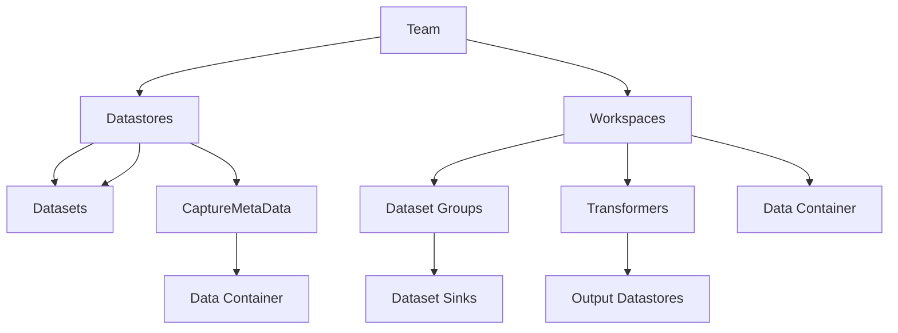

# What is a team

A team is a group of people working together who own some of the following aspects of a data ecosystem within a firm.

- DataStore and its Datasets
- Workspace/DataTransformer

The Team operates under the policies of a specific Governance Zone. The policies of the GovernanceZone apply to all data producers and consumers defined by the team.



## Declaring a Team

A team must first be declared by the GovernanceZone that will police the team. Once, a TeamDeclaration indicating the team name and git repository for changes has been created any approved to the ecosystem main repository then the team can use its repository to define the team and then commit it to the ecosystem main branch.

The code to declare a team should be added to a Governance Zone:

```python

    gz.add(
        ...
        TeamDeclaration("FrontOffice", GitHubRepository("billynewport/repo", "FOmain")),
        ...
    )
```

This shows the name of the team, "FrontOffice" and the git repository allowed to make changes to team objects.

## Defining a team

Once a team has been officially declared in a governance zone then the team objects can be defined using the typical git process. For example, a team might define a simple Datastore with a single dataset inside it like this:

```python
    t : Team = gz.getTeamOrThrow('FrontOffice')
    t.add(
        Datastore("NW_Data",
            CDCCaptureIngestion(
                PyOdbcSourceInfo(
                    eco.getLocationOrThrow("Azure", ["USA", "East US"]), # Where is the database
                    serverHost="tcp:nwdb.database.windows.net,1433",
                    databaseName="nwdb",
                    driver="{ODBC Driver 17 for SQL Server}",
                    connectionStringTemplate="mssql+pyodbc://{username}:{password}@{serverHost}/{databaseName}?driver={driver}"
                ),
                CronTrigger("NW_Data Every 10 mins", "0,10,20,30,40,50 * * * *"),
                IngestionConsistencyType.MULTI_DATASET,
                AzureKeyVaultCredential("https://mykeyvault.vault.azure.net", "NWDB_Creds")
            ),

            Dataset("us_states",
                DDLTable(
                    DDLColumn("state_id", SmallInt(), NullableStatus.NOT_NULLABLE, PrimaryKeyStatus.PK),
                    DDLColumn("state_name", VarChar(100)),
                    DDLColumn("state_abbr", VarChar(2)),
                    DDLColumn("state_region", VarChar(50))
                )
            )))
```

This shows us getting a reference to the team from the zone declaring it. Then we add a Datastore called 'NW_Data', specify how it can be ingested and then define a single Dataset 'us_states'.
