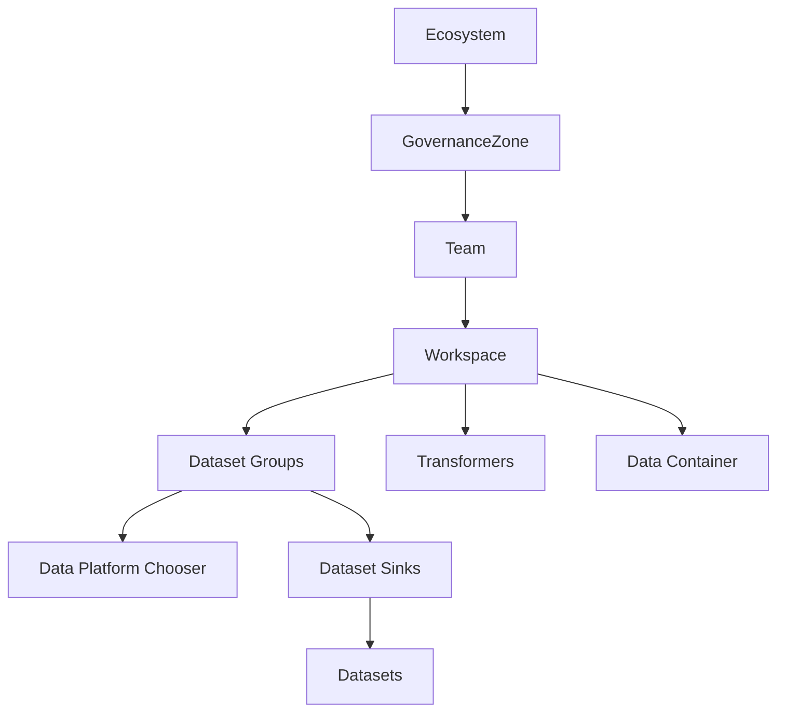
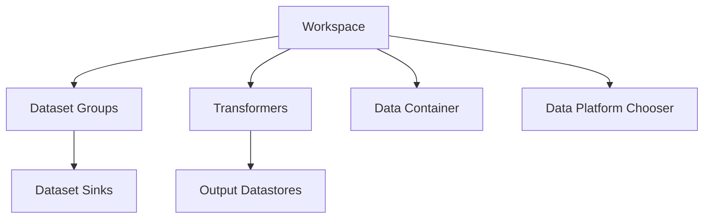

# Workspaces

Workspaces are the metadata a consumer of data creates within the ecosystem model. They are the key to the system. If there were no consumers, then datasurface would have nothing to do, no data to move. DataSurface works backwards from Workspaces towards data producers to identify all the data producers and data transformers needed to provide the data specified in a Workspace to the consumer.



A consumer of data of an ecosystem must define a Workspace within a Team within a GovernanceZone. Users can choose to have Teams for managing just workspaces or Teams which manage Datastores and Workspaces, its a choice.

A consumer uses a Workspace to define the data that they require as well as how they want the data to be delivered to them. A consumer describes the delivery requirements of the workspace using a WorkspacePlatformConfig. This allows the consumer to specify:

* The type of data container that they need for this use case (OLTP/OLAP/Object based)
* Where the data is needed
* how much data latency is desirable
* Whether the data needs to be milestoned or not
* How long data should be retained for and so on.
* Regulatory retention requirements and how that data can be stored.

The ecosystem will then use this information to choose a DataPlatform to host the data pipeline for the Workspace.

Consumers may also specify they want to use multiple of these for a single application. A Workspace has multiple DatasetGroups. A DatasetGroup has one or more DatasetSinks. EAch DatasetSink describes a dataset which the consumer needs for their application. Each DatasetGroup can specify its own WorkspacePlatformConfig. A Dataset can be specified multiple times within a single Workspace, once per DatasetGroup. This is allowed so consumer may require a live, low latency version of a dataset as well as a much high latency version of the same dataset which is fully milestoned.



## Workspace Priority

A Workspace has a priority. This is relative to other Workspaces. The priority indicates how important a Workspace is to the organization compared with other Workspaces. The priority of the pipelines gathering or collecting data used for a Workspace is set by the Workspace priority. If data is used by multiple Workspaces then the priority is set to the highest priority Workspace.

Thus, priority is not set by the teams who own data, it's set by who is using the data.

It's important to note that priority is relative. There is typically a lot of pressure from teams to increase the priority of their Workspaces. However, it's all relative, if everyone is important then no one is important.

DataSurface supports the following priority values defined in the enum `WorkspacePriority`:

* CRITICAL
* HIGH
* MEDIUM
* LOW

Within each priority tier, Workspaces will be further prioritized by deliverable time pressure. A CRITICAL Workspace with a 6pm deliverable will be prioritized higher than a CRITICAL Workspace with a 8pm deliverable.

## DataContainer

Data containers host the data for the consumer. The ecosystem will deliver the data from the producers to this container where the consumer will be able to query it. There are a variety of data container types and they will consistently change. Examples of data container types are:

* Lake House (object store + Delta capable columnar files + Data catalog)
* Traditional OLTP SQL Databases
* Traditional OLAP SQL Data warehouses

Data containers are typically located with an InstructureLocation which is owned by an InfrastructureVendor. Datasets can only be stored on a Data container if the GovernanceZone that polices the dataset allows it. Some GovernanceZones may not allow cloud vendors or may not allow on site vendors.

[See Data Containers for more information](DataContainers.md)

## DatasetGroups

A DatasetGroup allow a consumer to specify a group of datasets and the consumer can specify how they want the ecosystem to present the data through some metadata called 'Data Platform Chooser', DPC. The DPC allows the consumer can specify the data latency requirements in terms of SECONDS or MINUTES of even HOURS may be acceptable.

The consumer can also specify if they require just the current live records of each dataset or if they require milestoned or temporal versions of the datasets which include both the live and previous versions of every record in the dataset.

The Ecosystem interprets these requirements (the DPC) and selects an appropriate data platform from the set that are available. These can be constrained by the GovernanceZones that own data in the Dataset.

Most applications will only use a single DatasetGroup. But, more complex applications may require multiple DatasetGroups to satisfy the requirements of the application. Thus, a consumer might require data which is real time as well as batched data. The consumer can specify this by using multiple DatasetGroups.

### DatasetSinks

A datasetgroup has one or more datasetsink references. This basically states the consumer would like to use a specific dataset in a Workspace using the data pipeline selected by its DatasetGroup. A dataset can be used in multiple datasetgroups and different data pipelines may be used to serve it to the DataContainer for a single Workspace. A datasetsink also specifies the depreciation policy the consumer is ready to allow for this dataset. This allows a consumer to say it does not want to use deprecated data at all or it will allow the use of it temporarily while alternative sources for that data are determined. This works together with the data producers ability to mark datasets as deprecated.

### Creating a Workspace in Python

The following shows how a Workspace can be defined in Python. This change would need to be made within a specific Team github repository and then pull requested in to the main ecosystem repository.

```python
    gz : GovernanceZone = eco.getZoneOrThrow("USA")
    ourTeam : Team = gz.getTeamOrThrow("OurTeam")

    ourTeam.add(
        Workspace("ProductLiveAdhocReporting",
            PlainTextDocumentation("This workspace is used to provide live adhoc reporting on the product data"),
            AzureSQLDatabase("AzureSQL", "hostName:port", "DBName", eco.getLocationOrThrow("AZURE", ["USA", "Central US"])),                            
            DatasetGroup("LiveProducts",
                WorkspacePlatformConfig(
                    ConsumerRetentionRequirements(DataRetentionPolicy.LIVE_ONLY, 
                        DataLatency.MINUTES, # Minutes of latency is acceptable
                        None, # Regulator
                        None) # Data used here has no retention requirement due to this use case
                    ),
                DatasetSink("NW_Data", "products"),
                DatasetSink("NW_Data", "customers"),
                DatasetSink("NW_Data", "suppliers"))
        ))

```

This first gets references to the USA gz and then the OurTeam team within that gz. Next, we add the new Workspace to the team. The Workspace is called "ProductLiveAdhocReporting". It expects the data to be available on the "Test Azure SQL" data container.

The DatasetGroup "LiveProducts" specifies that the consumer requires a low latency version of the products, customers and suppliers datasets. The WorkspacePlatformConfig specifies that the data should be live only (no historical data records or milestoning) and that minutes of latency is acceptable. The data has no retention requirement.

### How a DataPlatform using an DataContainer might render DatasetSinks

Dataplatforms are the underlying mechanism for how data arrives in Data containers for data consumers. If the data container was a typical database or lakehouse then the data would be kept up to date in a physical table. Consumers might use a softlink or a view to reference that physical table. Their view may be named by combining the Workspace, DatasetGroup and Dataset names together.

The view is usually an important abstraction as it provides the data platform flexibility if columns are added to the dataset. A new table can be created and provisioned with the new column while existing consumers continue to use the existing table and views. The Dataplatform will simultaenously keep the original table up to date. When the new table has caught up and is ready for use then the data platform would alter the consumer views to point at the new table and then delete the old table.

## Producer approval of consumers

It's possible that a datastore owners requires explicit approval for a consumer to use a dataset before it can be used. See [Datastores](Datastores.md) for more information.

[See Data Platforms for more information](DataPlatform.md)
