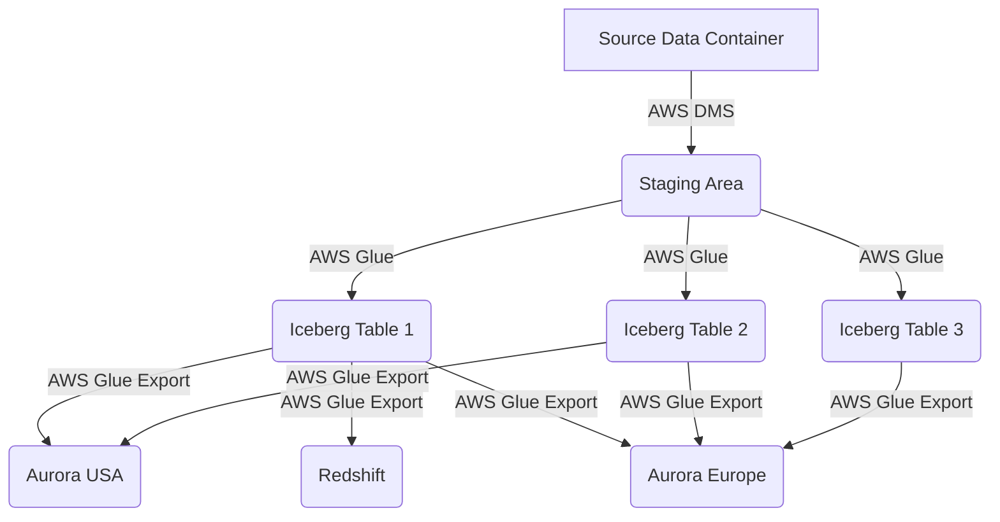
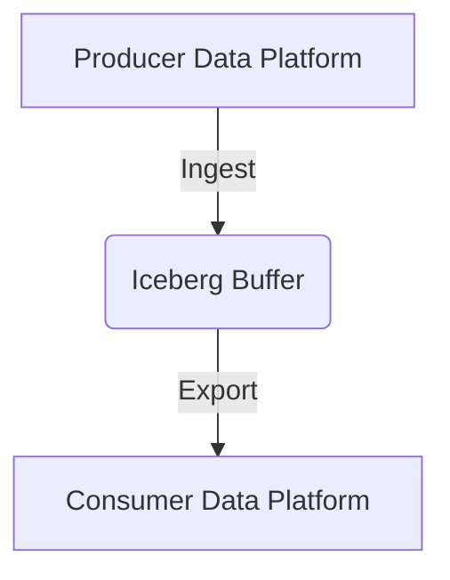

# Amazon AWS Batch Data Pipeline design

This document describes the philisophy behind the design of the first AWS Batch DataPlatform. It isn't intended to be the best DataSurface data platform. It's intended to show how a particular design philosophy can be implemented with a DataSurface Data platform.

## Design Philosophy

This will be a conventional batch data pipeline. It will ingest data from sources in to a staging area. The staging area will then be processing in to a set of tables which allow the data to be replayed to other data containers used by consumers. Data Transformations will be supported by any data container supported by the data platform.

The pipeline will be fully generated from the Ecosystem model. The subset of that model which was selected to run on this platform will be rendered as a Terraform IaC project and kept up to date in a Github Repository. Terraform will be configured to watch that repo and apply all changes to an AWS account.

This means that when the ecosystem model is modified then the IaC will be updated and the AWS resources will be updated. This is a very powerful way to manage the data platform. It allows the data platform to be managed by the data producers and consumers.

## Ingestion and staging

The data platform uses AWS DMS to ingest data from sources in to an S3 based staging area. AWS DMS is a managed service that can be used to move data from a source to a target. The source can be a database, a data warehouse or a data lake. The target can be a database, a data warehouse or a data lake. The data platform uses S3 as the target for the DMS service. The data platform uses the DMS service to move data from the source to the staging area.

AWS DMS brings the following benefits to the data platform:

* It's a managed service. This means the data platform doesn't have to manage the infrastructure for the service.
* It supports many source connectors such as Oracle, SQL Server, MySQL, PostgreSQL, MongoDB, Amazon Aurora, Amazon Redshift, Amazon S3, and Amazon DynamoDB. These sources can also be on-premises or in the cloud.

AWS DMS copies initial snapshots and then changes to the S3 bucket.

AWS DMS with AWS Glue has lots of disadvantages also. AWS Glue jobs uses job bookmarks to track where they are in terms of processing the input files. However, I don't see a way for this code to track when DMS transitions from LOADing to sending DELTAs. When LOADing, the Glue job can simply do upserts for every record found. When doing DELTAs then a MERGE type operation of handling new records, updated records and deleted records is needed. This is not supported by AWS Glue. This means that the data platform will need to use a custom solution to handle the DELTAs. This is a significant disadvantage of using AWS DMS with AWS Glue. The AWS examples all assume the user will switch the Glue code after DMS finishes loading to a DELTA code program manually. I'd prefer this to be seamless.

## Alternatives for ingestion/staging and buffering

This is a relatively heavy weight and clunky way to ingest data and keep it in a snapshot + delta format for use downstream hydration of data containers used by consumers. For example, there are products such as [Estuary](http://estuary.dev) which can be used to ingest the data in to a streamstore (managed by them) and from there, the data can be materialized in other data containers. This is more efficient than using the approach described above and is under consideration as an alternative in this initial implementation.

## How the DataPlatform interacts with the DataSurface model

The code described below should use the schema defined by the Data Producer in the Ecosystem model on the live branch of the repository.

This platform will fork the DataSurface repository at this point and then generate the IaC translation for that fork. This will be used to create the AWS resources for the data platform.

The ecosystem model will continue to be modified. At some point, this DataPlatform will fork the live branch again and then generate the new IaC translation for the new fork. The new IaC translation will be used to update the AWS resources for the data platform.

## Processing

The staging files are not ideal for querying directly or using them for materializing data in other data containers. The staging data consists of files representing an initial snapshot or load from the sources and then files representing changes from that point onwards. These need to be consolidated to provide a live image of the data in the source. This live image also needs to support the hydration and maintenance of this data in othr data containers. The live image may be used to hydrate multiple data containers concurrently at different stages of the maintenance process. For example, some data containers may be up to date and accepting changes. Others may be in the process of being initially hydrated. This means the live tables needs to support snapshots and deltas.

This solution uses AWS Glue to process the staging data in to a set of tables. We will create a python spark script which handles both initial snapshots and changes. This script will be run by AWS Glue using a cron trigger with AWS Event Bridge. The script will use AWS Bookmark is maintain the job state.

If the job state is missing then we are beginning an initial load. We will process load in stages and update the bookmark at each stage. Once the initial load is complete then we will update the bookmark to indicate that we are in the incremental mode. We will then process incremental changes and update the bookmark at each stage. Each stage duration will be governed by either run to completion or a time limit. The script will be idempotent. The script will use the bookmark service for all job state.

The iceberg tables will be stored in the AWS Glue Data Catalog. The iceberg tables will be used to support snapshots and deltas. The iceberg tables will be used to hydrate other data containers.

They can also be directly queried by consumers using AWS Redshift or Athena with security provided by AWS Lake Formation.

This could be optimized differently if its determined that there will be many others of the data outside the primary AWS region. It may make sense to use a second DataPlatform instance, distinct from the first, so that data is buffered once between the first region and the other regions. This would save on network egres costs during multiple hydrations and ongoing change pushing.

We can imagine such graphs holding thousands of sources, hundreds of thousands of tables and thousands of data consumers hosted on tens or hundreds of data containers suited for their use cases. All running on a common data platform that can be managed centrally at a much lower cost than the traditional bespoke pipeline approach.

## Manage pushing DataSurface producer schemas to AWS Glue Catalog

The DataPlatform will need to manage the AWS Glue Data Catalog tables. The DataPlatform will need to create the tables and keep them up to date with the DataSurface model. The DataPlatform will use the DataSurface model to create the tables. The DataPlatform will also use the DataSurface model to keep the tables up to date. The DataPlatform will use the DataSurface model to create the tables and keep them up to date. Glue Tables for producer and consumer schemas will need to be maintained when they change.

## DataPlatform transformations

The DataPlatform is given the intention graph from DataSurface. This consists of a DAG indicating the following types of node:

* Ingestion Multi
* Ingestion Single
* Transformation
* Export to DataContainer

The DataPlatform will use the intention graph to create the AWS Glue jobs and the AWS DMS tasks. The DataPlatform will also create the AWS Glue Data Catalog tables and the AWS Lake Formation permissions. The DataPlatform will use IaC to create and maintain AWS resources to support the intention graph. We need to decide between using Terraform or AWS CDK for this.

## Managing Iceberg compaction for tables used for snapshots and deltas

AWS Glue does not handle compaction of these tables. This is necessary to avoid poor read performance. The timing of when we do compaction is important. When we need to hydrate a consumer data container like an AWS Aurora database or any kind of database with an independent storage then we first need to send a snapshot and then all the deltas from the snapshot onwards. If we compact the iceberg tables before we have sent all the deltas then we will have to send the entire snapshot again. This is not efficient. We need to compact the iceberg tables after we have sent all the deltas from the snapshot onwards. We need to be able to do this in a way that doesn't affect the performance of the data platform. Some hydrations may take days to complete. Therefore, we need a able to delay compaction while we are hydrating a consumer data container. We can accomplish this with a soft locking mechanism. If present then this is disable compaction. When compaction starts then it also locks the table meaning hydrations will be blocked until compaction finishes. This is similar to a multi-reader/single writer lock. Hydrations will obtain a read lock and compaction will obtain a write lock.

If consumers are using a Workspace directly mapped to the iceberg tables then this is difficult. There is no way to know whether there are long running queries using data files which may be deleted when compaction is executed. Thus, we will configure compaction to run at 24 hour or longer intervals which allows query run times of up to 24 hours or more. This is a limitation of the iceberg table format. It's not a limitation of the data platform.

## Hydrating assets for consumers

We also need a AWS Glue job to hydrate the consumer data containers that the DataPlatform will support. This job needs to create the tables on the data container. It then needs to create a view pointing at the table for each consumer datasetgroup for that dataset. Consumers do not access the raw table directly. They are provided a view instead. This allows the DataPlatform to use different tables for maintenance if required and then remap the views to point at the new tables if required. This may be necessary when columns are added but have not been backfilled yet. Consumers can continue using the old view without the columns while a new table is being hydrated with the complete data. When the table is ready then the view can be remapped to point at the new table.

## Federating with other DataPlatforms

Data producers have their data in a production database. This means the database does not have unlimited capacity and especially when doing initial full snapshots, the load on a production database can become unacceptable. This is the reason for using iceberg tables as a buffer between consumer data containers and the producer data containers. It decouples them and consumer hydration or rehydration events can be serviced from the intermediate iceberg tables and leave the producer data container in peace.

Data producers will pick a Dataplatform as its primary ingestion service. This means that if a consumer wants data from a producer and the consumer is using the same Dataplatform as the producer then thats easy, they can connect. But, if the consumer is using a different DataPlatform then if we are going to limit the ingestion load on the producer to a single DataPlatform then the two DataPlatforms need to cooperate. The consumer data platform will pull data from the iceberg buffer tables in the AWS case. This also means that consumer data latencies will not be better than the latencies possible from the data producer dataplatform. This means here:

Thus, choosing which DataPlatform is the primary can have an impact on the overall latench in a multiple DataPlatform system.

It's also possible to use an AWS DataPlatform for the data producers and consumers. Later, some new data consumers can be added which want to use a data container provided by a different cloud vendor. There are many ways to handle this. One approach is to make a buffer in the second cloud vendor, The data is moved from AWS to the buffer (which could be iceberg based also), Once, it's in the buffer then its distributed from there to the data containers on the second cloud vendor. This minimize network egress costs because data is just transferred to the second vendor once and then fanned out from there to the data containers on the second cloud vendor.

This applies whether there is two cloud vendors or five cloud vendors. There will be a federating DataPlatform which manages this over multiple data platforms.

## Parameters for DataPlatform

The DataPlatform will have the following parameters:

* The DataPlatform instance name
* The DataPlatform AWS Region
* The DataPlatform AWS Account
* The DataPlatform AWS IAM Role
* The Staging AWS Bucket (Name, IAM Role and prefix)
* The IceBerg AWS Bucket (Name, IAM Role and prefix)
* The AWS Glue Database Name and IAM Role.

The DataPlatform will use these parameters to create the AWS resources for the data platform. More than one DataPlatform can be created, for example, one for development, one for production. Governance Zone policies can restrict non production data stores to using non production DataPlatforms.
