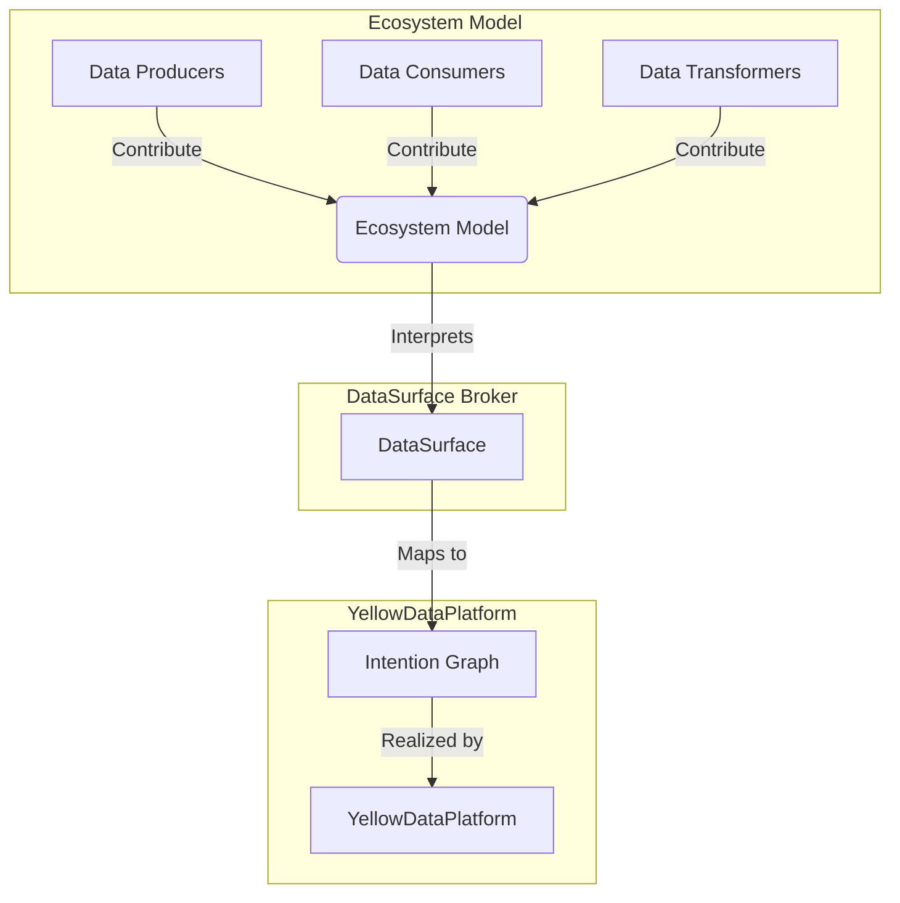
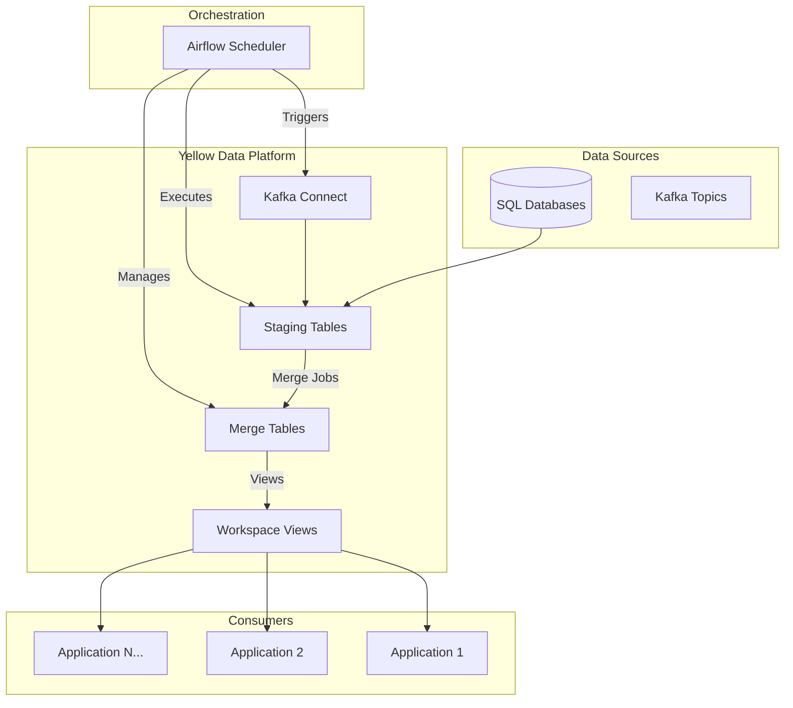
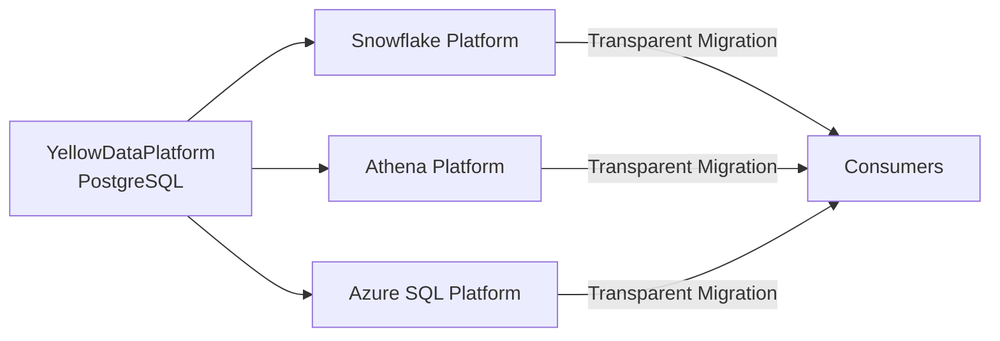

# YellowDataPlatform: A Modern, Kubernetes-Native Data Platform

*How DataSurface's initial data platform revolutionizes enterprise data ingestion with SQL Databases, Airflow, and intelligent orchestration*

## Introduction: The Enterprise Data Pipeline Problem

Enterprise data teams face a brutal reality: **data pipelines are a nightmare**. Traditional approaches create point-to-point connections resulting in **P × C pipelines** (producers × consumers), leading to combinatorial maintenance overhead, vendor lock-in, and data teams drowning in infrastructure instead of creating value.

Enter **DataSurface** - a revolutionary data ecosystem broker that transforms this chaos into manageable simplicity. **YellowDataPlatform** represents the first implementation in the DataSurface ecosystem - a pragmatic, lightweight solution designed specifically for small to medium enterprises that need powerful data capabilities without enterprise-scale complexity.

## What is DataSurface?

Before diving into YellowDataPlatform, it's essential to understand the broader vision. DataSurface redefines Infrastructure as Code (IaC) into **"Intention as Code"** (IaC 2.0). Instead of building complex pipelines, enterprise actors simply express their data intentions:

- **Data Producers** declare what data they generate
- **Data Consumers** specify what data they need and how they want it
- **Data Transformers** define derivative data creation
- **Data Platform owners** create platform products to satisfy these needs

The **DataSurface Broker** then arbitrates between consumer intentions and available data platforms, automatically selecting the best platform for each use case and generating the necessary data flow graphs.



This approach reduces pipeline complexity from **P × C** to **P + C + T**, eliminating vendor lock-in and allowing teams to focus on value creation rather than infrastructure plumbing.

## YellowDataPlatform: The First DataPlatform Implementation

YellowDataPlatform serves as DataSurface's initial implementation - a production-ready, Kubernetes-native data platform designed for small to medium enterprises. It proves the ecosystem broker concept works while maintaining operational simplicity and cost-effectiveness.

### Design Philosophy

YellowDataPlatform embodies a **"start simple, scale smart"** philosophy tailored for small to medium enterprises:

- **SQL-First Architecture**: Betting on SQL's 40+ year proven track record rather than complex distributed systems
- **SQL Databases as Foundation**: Leveraging SQL Databases' proven reliability and surprising scalability for most enterprise workloads
- **Kubernetes-Native**: Built for modern cloud environments while maintaining operational simplicity
- **Pragmatic Scaling**: Easy to start with, transparent evolution path as organizations grow

## Technical Architecture

### Core Components

YellowDataPlatform consists of four primary technical components:

#### 1. **Kubernetes Container Orchestration**
- Complete container lifecycle management
- Automatic scaling and resource management
- Service discovery and networking
- Persistent volume management for data storage
- Runs on private kubernetes or AWS EKS.

#### 2. **Apache Airflow Job Scheduling**
- Leverages Airflow's dynamic DAG generation for flexible ingestion stream management
- Kubernetes Pod Operators for executing DataSurface jobs
- Standard Airflow scheduling and monitoring capabilities

#### 3. **SQL Database Data Storage**
- **Staging Tables**: Raw ingested data with batch metadata
- **Merge Tables**: Clean, queryable data for consumers
- **Workspace Views**: Consumer-specific data access with proper permissions
- High-performance indexing for both staging and merge operations
- Supports Postgres, AWS Aurora, SQLServer, Oracle, DB2

#### 4. **Kafka Connect Integration**
- Seamless ingestion from SQL databases
- Change Data Capture (CDC) support via Debezium
- Topic-to-staging table streaming
- Configurable through Terraform providers

### Data Flow Architecture



## How YellowDataPlatform Works

### 1. **Data Ingestion Process**

YellowDataPlatform supports multiple ingestion patterns:

#### **Batch Snapshot Ingestion**
```python
# Simplified example of the ingestion flow
class SnapshotMergeJobLiveOnly(Job):
    def executeBatch(self, sourceEngine: Engine, mergeEngine: Engine, key: str) -> JobStatus:
        # 1. Create new batch ID
        batchId = self.createNewBatch(mergeEngine, key)
        
        # 2. Ingest data to staging with hashing
        self.ingestNextBatchToStaging(sourceEngine, mergeEngine, key, batchId)
        
        # 3. Merge staging to production tables
        self.mergeStagingToMerge(mergeEngine, batchId, key)
        
        # 4. Create/update workspace views
        self.createViews(mergeEngine, key, batchId)
```

Each ingested record gets augmented with:
- **Batch ID**: Tracking identifier for processing runs
- **Key Hash**: MD5 hash of primary key columns
- **All Hash**: MD5 hash of all columns for change detection

#### **Real-time CDC Ingestion**
Kafka Connect with Debezium captures database changes in real-time, streaming them to staging tables where merge jobs process them incrementally.

### 2. **Staging Tables: The Ingestion Layer**

Staging tables serve as the platform's ingestion buffer:

```sql
-- Example staging table structure
CREATE TABLE staging_customers (
    -- Original columns
    customer_id INTEGER,
    name VARCHAR(255),
    email VARCHAR(255),
    
    -- DataSurface metadata columns
    ds_surf_batch_id INTEGER,
    ds_surf_key_hash VARCHAR(32),   -- Hash of primary key
    ds_surf_all_hash VARCHAR(32)    -- Hash of all columns
);
```

**Key Features:**
- Schema evolution support with automatic table alterations
- Performance indexes on hash columns for efficient merging
- Batch-based processing for data lineage tracking
- Internal platform tables (not exposed to consumers)

### 3. **Merge Tables: The Production Layer**

Merge tables contain the final, queryable data. YellowDataPlatform supports two merge strategies:

#### **Live-Only Merge** (Default)
SCD Type 1 capability, keeps the latest live records from the source systems.

#### **Forensic/Milestoned Merge**
SCD Type 2 capability, keeps the historical records from the source systems. All versions of the source records are kept in the system. This is a linked list of records for each record key. Each linked list entry has the version of the record and when it was created, updated, deleted and if necessary reinserted.
- Complete historical record preservation
- Point-in-time querying capabilities
- Compliance and audit trail support

### 4. **Workspace Views: The Consumer Interface**

Consumers never directly access staging or merge tables. Instead, YellowDataPlatform creates workspace-specific views:

This approach provides:
- **Security isolation**: Each workspace sees only authorized data
- **Schema abstraction**: Views can hide platform metadata
- **Flexible data presentation**: Custom transformations per consumer
- **Permission management**: Fine-grained access control

## Job Orchestration and Management

YellowDataPlatform leverages Airflow's dynamic DAG generation capabilities to manage ingestion streams efficiently. Rather than maintaining static DAG files for each data source, the platform uses Airflow's standard dynamic DAG functionality with database-driven configuration stored in the `platform_airflow_dsg` table. This approach provides configuration-driven DAG creation and reduces operational overhead.

## Kubernetes Deployment Architecture

YellowDataPlatform is designed as a private or cloud-native application with sophisticated Kubernetes orchestration:

This approach provides:
- **Resource Isolation**: Each job gets dedicated compute resources
- **Fault Tolerance**: Job failures don't affect the platform
- **Scalability**: Kubernetes automatically schedules across nodes
- **Security**: Jobs run with minimal required permissions

## Performance and Scalability Considerations

### SQL Databases as the Foundation

YellowDataPlatform's choice of SQL Databases as the primary storage engine is deliberate and strategic:

**Scalability Reality Check:**
- Modern SQL Databases instances can scale to large hardware footprints
- AWS RDS supports instances up to 192 vCores with 768GB RAM
- **The fastest distributed database is a single-node database large enough for the workload**
- Distribution has costs; single-node systems outperform distributed systems up to a significant threshold
- The fastest distributed database is a single-node database large enough for the workload

**Performance Optimizations:**
```sql
-- Staging table indexes for merge performance
CREATE INDEX idx_staging_batch_id ON staging_table(ds_surf_batch_id);
CREATE INDEX idx_staging_key_hash ON staging_table(ds_surf_key_hash);
CREATE INDEX idx_staging_all_hash ON staging_table(ds_surf_all_hash);

-- Merge table indexes for query performance  
CREATE UNIQUE INDEX idx_merge_key_hash ON merge_table(ds_surf_key_hash);
CREATE INDEX idx_merge_batch_id ON merge_table(ds_surf_batch_id);
```

### Airflow Scaling Limitations and Solutions

**Current Limitations:**
- Airflow effectively supports thousands of our simple DAGs
- Each ingestion stream creates one DAG
- Suitable for most enterprise use cases

**Future Evolution Path:**
- DataSurface's architecture enables transparent platform migration
- When better platforms emerge, consumers automatically benefit
- No re-engineering required for consumer applications

## Schema Evolution and Data Integrity

YellowDataPlatform includes sophisticated schema management:

### Automatic Schema Evolution

### Change Detection and Validation
- **Hash-based change detection** prevents unnecessary processing
- **Schema fingerprinting** detects source structure changes  
- **Batch state management** ensures consistency across processing runs
- **Rollback capabilities** via the `resetBatchState` method

## Security and Governance Integration

YellowDataPlatform implements enterprise-grade security:

### Credential Management

Datasurface uses the native secrets credential management stores such as AWS Secrets Manager or Kubernetes secrets.

### Access Control
- **Workspace isolation**: Views provide data boundary enforcement
- **Role-based permissions**: Fine-grained access control per workspace
- **Audit trails**: Complete data lineage tracking
- **Encryption support**: Both client-side and server-side encryption

### Governance Policy Enforcement
DataSurface's governance zones can constrain:
- Which data containers can store specific data classifications
- Encryption requirements for sensitive data
- Geographic data residency requirements
- Compliance policy enforcement

## The Future: Columnar Evolution Path

While SQL Databases provide an excellent foundation, YellowDataPlatform's architecture anticipates evolution:

### Current SQL-First Strategy


This approach ensures:
- **Future-proofing**: Technology evolution without consumer disruption
- **Cost optimization**: Right-sized platforms for specific workloads  
- **Performance benefits**: Latest columnar storage advantages automatically

## Why YellowDataPlatform Matters

YellowDataPlatform represents a paradigm shift for small to medium enterprise data infrastructure:

### For Small to Medium Data Teams
- **Reduced complexity**: One platform handles multiple use cases without enterprise overhead
- **Operational simplicity**: Kubernetes-native with familiar tooling
- **Cost effectiveness**: PostgreSQL's efficiency without expensive distributed system licensing

### For Growing Organizations  
- **Zero pipeline code**: Express intentions, not implementation details
- **Incremental scaling**: Platform grows with your organization
- **Future-proof**: Transparent evolution path to more sophisticated platforms as needs grow

### For Pragmatic Architecture
- **Vendor independence**: SQL-based portability protects against lock-in
- **Governance ready**: Policy enforcement scales with organizational maturity
- **Technical debt prevention**: Automatic platform upgrades over time

## How to start up DataSurface with the YellowDataPlatform

We are testing on an Ubuntu environmentwith kubernetes 1.3.3 installed. The easiest way to get this running is the follow the instructions in the HOWTO: Setup YellowDataPlatform Kubernetes Environment.

It also runs on an AWK environment. Bringup is documented in [the AWS bring up document](HOWTO_AWS_SetupYellow.md)

We currently ask the agentic AI in cursor to follow the instructions in the HOWTO and it takes maybe 5 minutes to get a working environment. We are specifically designing HOWTOs that are easy for the AI to follow.

[HOWTO: Setup YellowDataPlatform Kubernetes Environment](HOWTO_Setup_YellowDataPlatform_Environment.md)

## Conclusion: The DataSurface Revolution

YellowDataPlatform proves that small to medium enterprises can access **powerful yet simple** data platforms. By embracing SQL's proven track record, Kubernetes' orchestration capabilities, and DataSurface's intention-driven architecture, it delivers a production-ready solution designed for organizations that need enterprise capabilities without enterprise complexity.

The platform's success validates DataSurface's core vision: **data infrastructure should be invisible plumbing that enables value creation, not a complex engineering challenge that consumes entire teams**.

As the first DataPlatform in the DataSurface ecosystem, Yellow establishes the foundation for a new generation of data platforms. It demonstrates that small to medium enterprises can access enterprise-grade data capabilities without the complexity, cost, and operational overhead traditionally required.

**The future of enterprise data is declarative, governed, and effortless. YellowDataPlatform is that future, available today.**

---

*Learn more about DataSurface and YellowDataPlatform at [github.com/billynewport/datasurface](https://github.com/billynewport/datasurface)* 